# Liquorice Backup

### Un dispositivo di backup fotografico in una scatoletta di liquirizia

Relazione per l'esame di Laboratorio di Making
Alma Mater Studiorum, Università di Bologna
Anno Accademico 2025/26

Autore: Stefano Bucciarelli  
Repository: <https://github.com/stbuccia/amarelli-backup>  
Documentazione utente (wiki): <https://github.com/stbuccia/amarelli-backup/blob/main/wiki/Home.md>

<table>
<tr>
<td style="width:50%; text-align:center; vertical-align:top;">
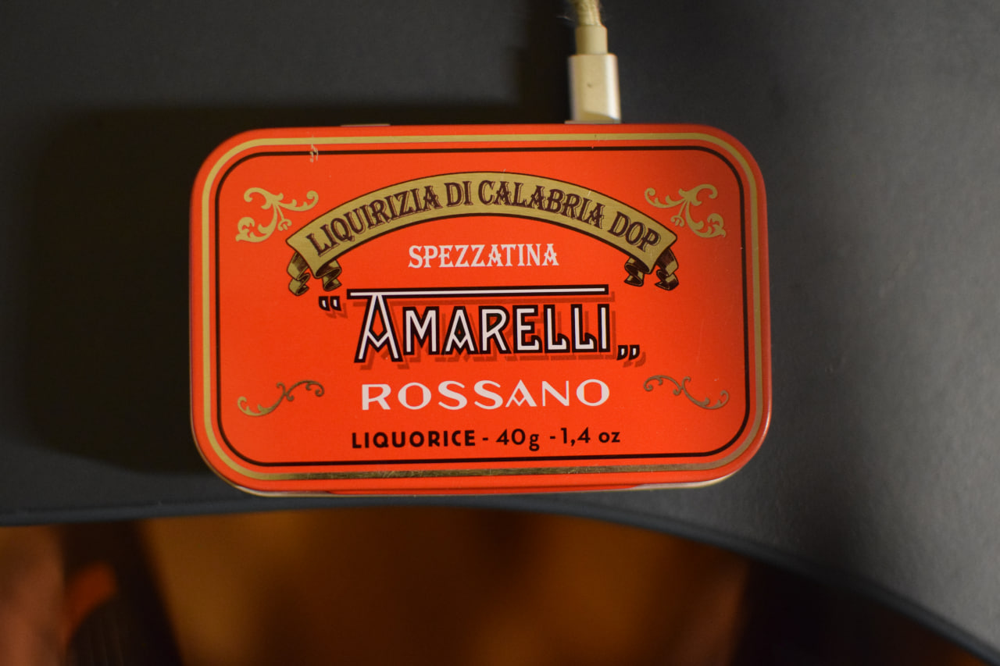
<br><em>Figura 1: Dispositivo chiuso — scatoletta Amarelli rossa (usabile a coperchio chiuso tramite LED).</em>
</td>
<td style="width:50%; text-align:center; vertical-align:top;">
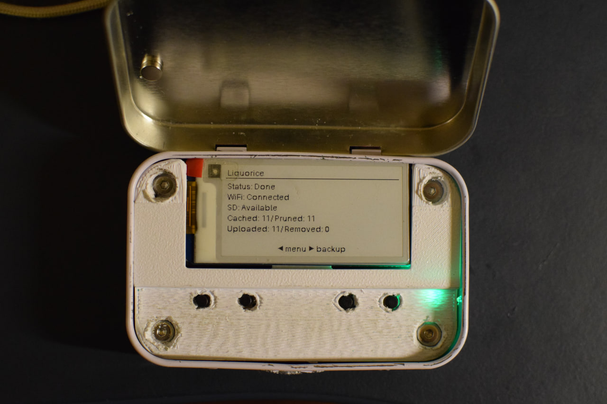
<br><em>Figura 2: Dispositivo aperto — e-paper 2.13" con stato "Done" e LED verde, topper bianco.</em>
</td>
</tr>
</table>

---

## Indice

1. [Introduzione](#1-introduzione)
2. [Hardware](#2-hardware)
3. [Breadboard e circuito](#3-breadboard-e-circuito)
4. [Assemblaggio](#4-assemblaggio)
5. [Modellazione e stampa 3D](#5-modellazione-e-stampa-3d)
6. [Software](#6-software)
7. [Sviluppi futuri](#7-sviluppi-futuri)
8. [Conclusioni](#8-conclusioni)

---

## 1. Introduzione

Questa relazione è in italiano perché è finalizzata all'esame, mentre tutto il resto del repository è in inglese, per garantire migliore riprodubilità.

Liquorice Backup è un dispositivo di backup fotografico costruito dentro una scatoletta di latta di liquirizia Amarelli. L'utilizzo è il seguente, si infila la microSD della fotocamera nel lettore sul fianco e il dispositivo copia subito le foto nuove in una cache locale per poi caricarle in background sul cloud. Un database tiene traccia di cosa ha già fatto, così non carica mai due volte lo stesso file.

I due passaggi sono deliberatamente indipendenti: per fare la cache non serve Internet, per fare l'upload non serve la SD. È questa separazione che rende il dispositivo utile in viaggio, che è il caso d'uso per cui è nato.

L'interazione avviene tramite uno schermo e-paper da 2.13", quattro pulsanti, un LED RGB e, per configurazioni più comode, come per impostare una connessione a una nuova rete WiFi, una pagina web servita dal dispositivo stesso.

Questa relazione si concentra sul perché delle scelte e sui dettagli implementativi, comprese le strade sbagliate. Non è un manuale, quindi chi volesse riprodurre il progetto o usarlo come utente finale trova tutto nella [wiki del repository](https://github.com/stbuccia/amarelli-backup/blob/main/wiki/Home.md).

### 1.1 L'idea

L'idea nasce da un problema reale: quando vado in vacanza porto la fotocamera ma non il portatile, e questo significa che per giorni le foto vivono in un unico posto, la scheda SD nella fotocamera, sperando sempre che non si corrompa. Esistono dispositivi commerciali che risolvono il problema, ma sono costosi, chiusi e legati all'ecosistema del produttore, e non ho trovato un progetto DIY open source equivalente.

Il secondo ingrediente è che il mio gusto apprezza abbondantemente le liquirizia Amarelli e, di conseguenza, un collezionista involontario delle loro scatolette di latta.

Per il progetto però ho scoperto che le lattine Amarelli misurano circa 94 × 60 × 22 mm, che è uno standard di fatto per le scatoline delle caramelle alla menta (ad esempio le Altoids) hanno praticamente le stesse dimensioni. Questo ha due conseguenze concrete. Il progetto diventa universale, perché chi non trova le scatolette Amarelli può usare qualsiasi altra mint tin standard. E come vedremo successivamente esistono già componenti pensati per quel formato, in particolare la Mint Tin Sized Perma-Proto Breadboard, che entra nella scatoletta senza tagli.

L'ispirazione formale viene dal MintyPi di sudomod, una console portatile per retrogaming costruita in una scatoletta di Altoids che avevo visto anni fa su YouTube. Da lì viene la voglia di provarci, ma le due implementazioni divergono, perché MintyPi si basa su un PCB progettato su misura mentre qui ho scelto la strada della perfboard cablata a mano (la scelta è rimandata al paragrafo 3.3).

### 1.2 Requisiti

Oltre a garantire il funzionamento sopra citato ho fissato tre ulteriori requisiti, che poi hanno determinato alcune scelte implementative successive:

1. Usabile anche a scatoletta chiusa. In viaggio il dispositivo starà in uno zaino, non su un tavolo, quindi serve un feedback che funzioni senza guardare lo schermo (il LED RGB) e una modalità automatica in cui il backup parte da solo.
2. Nessuna dipendenza da una rete Wi-Fi già configurata. Un dispositivo da viaggio si trova per definizione su reti sconosciute, da cui la separazione fra cache e upload e la possibilità di far creare al dispositivo un proprio access point.
3. Minimizzare gli accessi via SSH. Se per cambiare un'impostazione devo aprire un terminale, il dispositivo non è finito: da qui il menù a bordo e la pagina web.

---

## 2. Hardware

### 2.1 Il microcomputer: Raspberry Pi Zero W

Ho puntato su Raspberry Pi per la notorietà e per la quantità di documentazione disponibile. La scelta del modello è stata un processo di esclusione.

La gamma "grande" (Pi 3, 4, 5) l'ho esclusa per le dimensioni: 85 × 56 mm, e con i connettori Ethernet e USB-A pieni supera in altezza i 22 mm utili della scatoletta.

La gamma Pico l'ho esclusa perché essendo un microcontrollore non esegue un sistema operativo, ed avrei avuto complicazioni a riguardo, come: niente filesystem montabile, nessun modo di far girare rclone o SQLite, e una memoria RAM troppo piccola.

I Compute Module 4 e 5 li ho esclusi perché sono System-on-Module, non schede complete e non hanno l'header a 40 pin.

Restava la gamma Zero: 65 × 30 mm, header a 40 pin come le sorelle maggiori, Wi-Fi integrato, che qui è un requisito e non un extra. Fra Zero W e Zero 2 W ho scelto lo Zero W per il prezzo, molto inferiore al momento dell'acquisto, accettandone il limite. Avendo i due modelli identici GPIO e dimensioni, il progetto funziona senza modifiche anche con uno Zero 2 W.

### 2.2 Il lettore microSD: il problema della seconda scheda

Il Pi Zero ha un solo slot microSD, occupato dal sistema operativo, quindi serviva una seconda porta per la scheda della fotocamera. Ho valutato tre strade.

La prima era saldare sui pad dello slot SD del Pi. L'ho provato materialmente: non funziona, e a posteriori è ovvio, perché quello slot è collegato al controller SDIO del SoC, che gestisce una scheda sola ed è già occupato dal boot. Non si possono mettere due schede sullo stesso bus senza un controller che le multiplexi.

La seconda era cannibalizzare un adattatore USB-microSD e dissaldare il connettore USB liberando i quattro pad come mostrato in figura (VBUS, GND, D+, D-) :

<p align="center">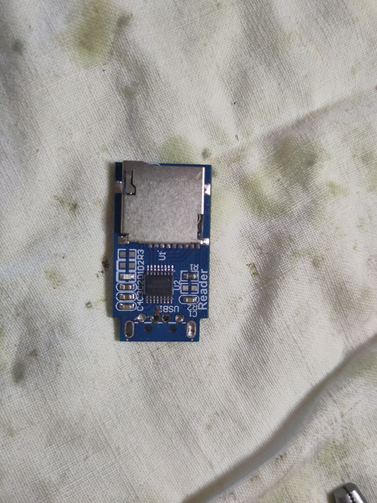</p>

*Figura 3: Lettore USB-microSD cannibalizzato: connettore USB dissaldato, visibili i quattro pad saldati a mano. Strada provata su banco ma scartata perché la Raspberry non rilevava la scheda.*

Per poi collegare i quattro pad del connettore a quattro pad della Raspberry (VBUS in PP1, GND in PP6, D+ in P22 e D- in P23) tramite fili saldati. In fase di test è stata provata questa strada ma dalla Raspberry non veniva letta la SD, quindi è stata scartata.

La seconda, che è quella scelta, è un lettore microSD su SPI: un modulino con sei pin che si attacca al bus SPI0. Il kernel Linux ha il driver `mmc_spi`, quindi la scheda diventa un normale device a blocchi (`/dev/mmcblk1`) montabile come qualsiasi altro. Si è rivelata giusta anche per una ragione che all'inizio non avevo considerato: è la meno esosa in termini di corrente, e visti i problemi di alimentazione descritti più avanti l'opzione USB non avrebbe comunque tenuto.

Il prezzo da pagare è la velocità più ridotta, che si traduce in maggior tempo per la copia locale precedente all'upload remoto. È accettabile perché il collo di bottiglia percepito è comunque l'upload sul cloud.

Un dettaglio importante è che il lettore condivide il bus SPI0 con lo schermo: lo schermo sta su CE0 (BCM 8), il lettore su CE1 (BCM 7), mentre MOSI e CLK sono in comune. È il funzionamento normale di SPI, dove il chip-select decide chi ascolta, ma richiede una configurazione esplicita.

### 2.3 Lo schermo: e-paper contro LCD

Ho valutato sia un display e-paper sia un LCD: L'LCD vince su reattività, colore e prezzo, ma consuma in modo continuo. L'e-paper ha le proprietà opposte, ed entrambe sono allineate ai requisiti: è bistabile, quindi l'immagine consuma solo durante il refresh, che per un dispositivo il cui stato cambia poche volte al minuto è il profilo ideale, ed è leggibile in pieno sole. I contro sono il refresh lento, il bianco e nero puro, nell'ordine dei secondi per un aggiornamento completo, ma dal momento che l'interazione utente è comunque limitata non ho valutato questi fattori come eccessivamente critici.

Ho scelto un Waveshare 2.13" e-Paper HAT (V4): 250 × 122 pixel, monocromatico a 1 bit, controller SSD1680, interfaccia SPI, controllando che la dimensione rientrasse nei limiti imposti dalla lattina. Nonostante abbia preso l'HAT per semplicità, ma non ho usato il suo connettore a 40 pin, perché impilarlo sopra il Raspberry avrebbe consumato tutta l'altezza disponibile. Ho usato invece il connettore laterale a 8 fili, tagliando le terminazioni femmina per saldare direttamente sulla board (vedi paragrafo 4.2).

### 2.4 Pulsanti, LED e reed switch

Quattro pulsanti tattili 6 × 6 × 6 mm, scelti per economicità e reperibilità, collegati fra il proprio GPIO e massa. Il numero è una decisione di progetto: inizialmente pensavo che due bastassero, ma il requisito di minimizzare gli accessi SSH implicava che tutte le impostazioni fossero modificabili a bordo, e quindi un menù navigabile. Con quattro tasti (su, giù, indietro, conferma) la navigazione in un menù è naturale, quindi mi sono sembrati il costo minimo per un'interfaccia decente.

Gli altri due componenti servono al primo requisito, l'usabilità a scatoletta chiusa, che schermo e pulsanti non soddisfano perché presuppongono entrambi il coperchio aperto.

Il primo è un LED indirizzabile WS2812B: la scelta dell'RGB invece di LED monocromatici è dettata dal numero di stati da rappresentare e la codifica avviene per colore, più il lampeggio come dimensione aggiuntiva (vedi paragrafo 6.4).

Il secondo è un reed switch, un interruttore che si chiude in presenza di un campo magnetico, abbinato a un magnetino incollato al coperchio: chiudendo la scatoletta il contatto si chiude e il software manda lo schermo in sleep, risparmiando energia ed evitando refresh inutili di un pannello che nessuno sta guardando. Qui ho sbagliato al primo tentativo comprando i reed in ampolla di vetro, i più comuni ed economici e anche estremamente fragili: si sono rotti mentre piegavo i terminali per farli stare nella board. Sono passato alla versione in plastica, che sicuramente si è prestata di più per essere maneggiata (vedi Figura 7 per il test su breadboard del reed in vetro).

### 2.5 Alimentazione: il tentativo fallito

Nel dispositivo finale la batteria non c'è e si alimenta via micro-USB. Questo implica che il dispositivo deve essere usato vicino a una presa di corrente o tramite powerbank. L'idea della batteria però c'è stata dall'inizio alla fine, e questa reputo sia la mancanza più grande nel risultato finale.

Dopo aver misurato lo spazio residuo avevo identificato una LiPo 803450 da 1500 mAh (50,7 × 34 × 8 mm), abbastanza compatta da lasciare spazio, sul piano orizzontale, anche al modulo di boost e carica.

Il primo tentativo è stato con boost e caricabatteria separati: un boost converter basato su TPS61023 più un modulo di carica per LiPo indipendente. Il problema è stato reso evidente già dai test con raspberry che non c'è nessun power path: con boost e caricatore indipendenti la batteria è contemporaneamente sorgente per il carico e destinazione della carica, e questo rende impossibile usare il dispositivo mentre si carica.

<p align="center">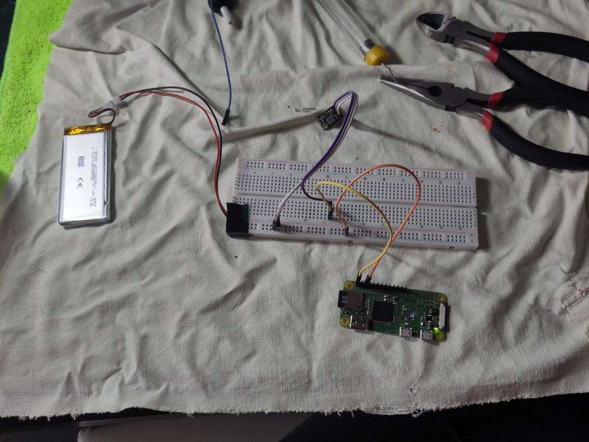</p>

*Figura 4: Primo tentativo di alimentazione su breadboard: modulo boost TPS61023 + caricatore LiPo separato (senza power path). Funzionante a banco ma inutilizzabile sotto carica.*

Il secondo tentativo è stato con un Adafruit PowerBoost 1000C, che sulla carta risolveva il problema: integra sulla stessa scheda un caricabatteria per LiPo con gestione del power path erogacorrente a 5V tramite boost TPS61090 e segnala la batteria scarica.

Inizialmente i test sono andati bene, il problema si è manifestato solo con il software completo e tutti i componenti collegati, il Raspberry continuava a riavviarsi, e da lì non ho più avuto tempo per sistemare la cosa. Non ho quindi una diagnosi definitiva, solo delle ipotesi: che il carico completo (Pi con Wi-Fi attivo, refresh dello schermo, lettura della SD e LED acceso) superi comunque l'ampere erogabile dal modulo nei momenti peggiori

Nelle prove avevo usato anche un MAX17043, un fuel gauge I2C, per leggere lo stato di carica e mostrarlo sullo schermo, e i test sul bus I2C erano andati a buon fine.

<p align="center">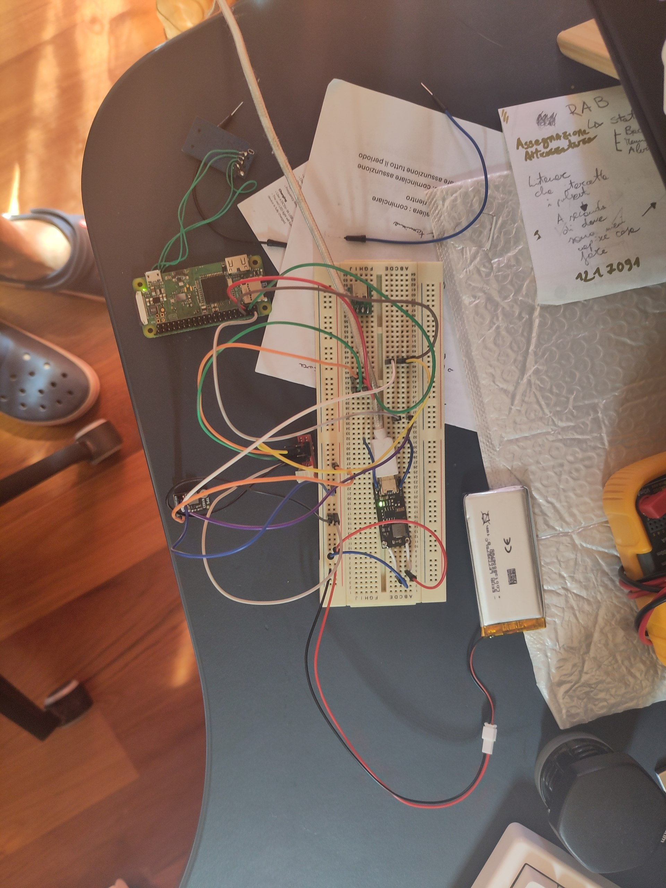</p>

*Figura 5: Test del fuel gauge MAX17043 su I2C con LiPo 803450 1500 mAh. La lettura dello stato di carica funzionava correttamente.*

Finito il tempo prima della scadenza dell'esame, ho preferito consegnare un dispositivo che funziona in modo affidabile alimentato via USB piuttosto che uno con la batteria e i riavvii. Rimane il primo punto degli sviluppi futuri (vedi capitolo 7), e la buona notizia è che la rinuncia alla batteria ha liberato parecchio spazio in altezza, semplificando l'assemblaggio finale.

---

## 3. Breadboard e circuito

### 3.1 Prototipazione su breadboard

Partendo da un basso livello di competenza elettronica, la breadboard è stata un passaggio necessario. La strategia è stata piuttosto semplice: un componente alla volta, ognuno con il suo test scritto ad hoc, per controllare di aver compreso come andassero collegati i componenti e che non ci fossero guasti fisici.

Questi test sono rimasti nel repository (`software/tests/hardware/`) e sono diventati uno strumento diagnostico permanente: quando qualcosa non va nel dispositivo assemblato, il primo passo è sempre rilanciarli per capire se il problema è nel cablaggio o nel software.

<p align="center">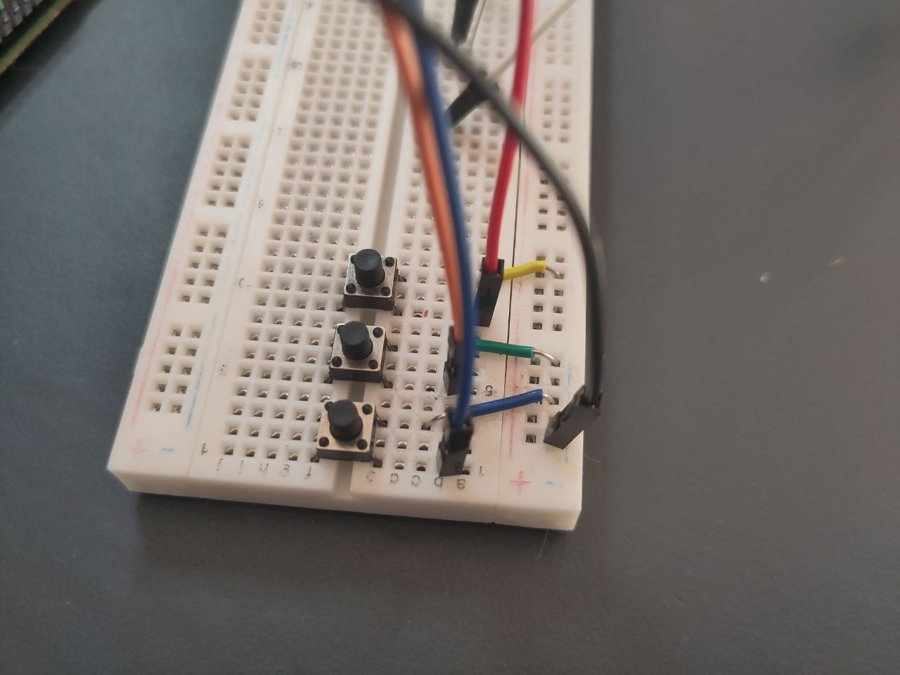</p>

*Figura 6: Test dei pulsanti tattili su breadboard (tre pulsanti in fase iniziale, poi quattro nel dispositivo finale): verifica di cablaggio e debounce.*

<p align="center">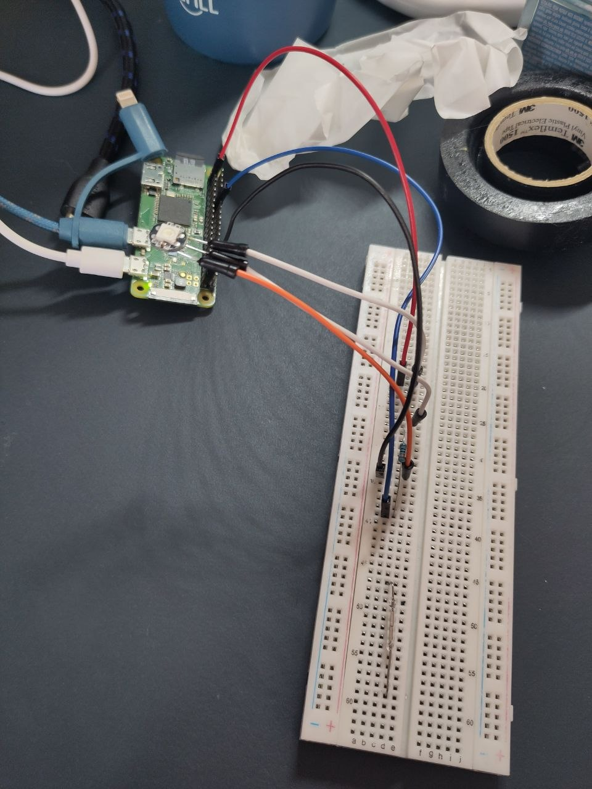</p>

*Figura 7: Test LED WS2812B + reed switch (ampolla di vetro, poi sostituito con versione in plastica) collegati al Pi Zero W: validazione del feedback a scatoletta chiusa.*

### 3.2 Lo schema elettrico

Prima di passare al circuito definitivo ho disegnato lo schema con EasyEDA (<https://easyeda.com>), un software per la progettazione PCB, l'ho scelto perché gira nel browser e ha una curva di apprendimento molto bassa.

Seguendo i consigli di alcune guide online non ho disegnato i collegamenti come fili, ma ho usato le net label: ogni pin porta un'etichetta, e due pin con la stessa etichetta sono elettricamente connessi.

<p align="center"></p>

*Schema elettrico: tutti i collegamenti verso il Raspberry Pi Zero.*

Il risultato, in sintesi:

| Componente | Interfaccia | Pin (BCM) |
|---|---|---|
| Display e-paper | SPI0, CE0 | DIN 10, CLK 11, CS 8, DC 25, RST 27, BUSY 24 |
| Lettore microSD | SPI0, CE1 | MISO 9, CLK 11, MOSI 10, CS 7 |
| Pulsanti | GPIO in pull-up | Left 5, Down 6, Up 13, Right 19 |
| LED WS2812B | PWM0 hardware | DIN 12 |
| Reed switch | GPIO in pull-up | 16 |

Una nota su RST 27: la documentazione Waveshare usa BCM 17 per il reset del display, ma sul mio Raspberry quel pin è danneggiato, quindi ho spostato il segnale su BCM 27 e ho fatto in modo che l'installer applichi la modifica al driver automaticamente (vedi paragrafo 6.1).

### 3.3 Perfboard contro PCB

A schema pronto, EasyEDA permetteva di generare direttamente un PCB da far produrre. Il PCB avrebbe dato dimensioni controllate al millimetro, nessuna saldatura di cablaggio e un risultato più professionale, ma in caso di errore non avrei avuto modo di risolverlo (e con il mio livello di esperienza la probabilità di errore era alta) e il costo era decisamente elevato considerando la spedizione. La perfboard, al contrario, rende ogni errore recuperabile dissaldando, e costa pochi euro, al prezzo di un cablaggio manuale lungo e delicato.

Ho scelto la perfboard, e la scelta è stata resa facile dalla disponibilità di una Mint Tin Sized Perma-Proto Breadboard: una perfboard con piste pre-stampate secondo la logica riga/colonna delle breadboard, prodotta esattamente nel formato delle mint tin. Entra nella scatoletta Amarelli senza tagli né adattamenti e avere piste già presenti riduce molto il cablaggio, perché i pin dei componenti vicini si collegano stando nella stessa colonna e le rotaie `+`/`−` distribuiscono alimentazione e massa in tutta la board.

---

## 4. Assemblaggio

### 4.1 Disposizione dei componenti

La disposizione è il risultato di vincoli che si sovrappongono. Dal lato frontale lo schermo deve stare in alto e i quattro pulsanti devono essere facilmente raggiungibili: ho deciso di rendere la vista dall'alto simmetrica, disponendo i pulsanti sulla stessa linea orizzontale subito sotto lo schermo(l'ordine riprende quello presente su vim da sinistra a destra è indietro, giù, su, conferma) .

Altri due componenti chiedevano di stare nella parte alta della board per funzionare bene: il LED (che deve affacciarsi al suo foro sulla latta per essere visibile a scatoletta chiusa) e il reed switch (che deve trovarsi il più vicino possibile al magnete sul coperchio). Li ho messi sui due bordi laterali, nelle colonne isolate della perma-proto (colonna 0 e colonna 32), dove i fori non sono in comune con altre righe e colonne, così i loro segnali non interferiscono con nient'altro.

Anche il lettore SD è nella parte alta, per una ragione precisa: mantenerlo orientato in modo che la scheda entri diritta rispetto al fianco della latta. Se fosse stato ruotato la SD sarebbe dovuta entrare dal lato opposto.

Di conseguenza al Raspberry Pi è rimasta la parte inferiore, montato capovolto sulla faccia posteriore della board, con l'header saldato dal lato inferiore e il bordo superiore del Pi allineato al bordo superiore della board (scelta necessaria perché la microusb sia raggiungibile dall'esternoa). Un'osservazione a posteriori: avendo rinunciato alla batteria ed essendo quindi obbligato ad esporre la microusb e avrei potuto ruotare il Raspberry per farlo appoggiare sul fondo della latta e avere in questo modo la microusb non ruotata, con lo stesso discorso fatto in precedenza con la SD.

<p align="center"></p>

*Vista frontale: schermo e Raspberry allineati al bordo superiore della board.*

<p align="center"></p>

*Vista posteriore: il Pi fissato sul retro della board e tutti i cavi di collegamento.*

### 4.2 Saldature e cablaggio

Due componenti non sono saldati ma incollati con nastro biadesivo forte (3M 5952 VHB): il Raspberry e lo schermo. È una scelta deliberata, perché sono i due pezzi più costosi e gli unici che potrei voler recuperare, e il biadesivo dà una tenuta meccanica sufficiente senza rendere lo smontaggio distruttivo. Tutti gli altri componenti sono saldati, usando dove utile degli header a pettine come supporto e tagliandone poi la parte in eccesso.

Il collegamento fra schermo e Raspberry è stato la parte più laboriosa, perché i due si trovano su facce opposte della board. Il connettore a 8 fili in dotazione allo schermo ha terminazioni femmina che non servono a nulla in questo contesto, quindi le ho tagliate ottenendo fili nudi, li ho fatti passare attraverso i fori della perfboard verso il lato inferiore e li ho saldati a destinazione. A seconda del segnale la destinazione è diversa: i segnali dedicati al display (CS/CE0, DC, RST, BUSY) vanno direttamente sui pin del Raspberry, mentre quelli condivisi con il lettore SD (MOSI e CLK) vanno saldati nella stessa colonna in cui è già attestato il lettore, sfruttando le piste della perma-proto per realizzare il bus condiviso senza doppie saldature sullo stesso pin. VCC e GND si prendono dalle rotaie `+`/`−`, alimentate a loro volta dal pin 1 (3,3 V) e dal pin 39 (GND).

Tutto il cablaggio corre sul retro del dispositivo, così la faccia anteriore resta pulita e il topper stampato in 3D può appoggiarsi in piano.

Un consiglio che vale la pena mettere per iscritto: prima di dare tensione ho verificato con il multimetro la continuità delle rotaie e l'assenza di cortocircuiti fra pin adiacenti, in particolare che nessun filo mettesse in contatto 5 V e 3,3 V.

<p align="center"></p>

*Vista dall'alto a cablaggio completato.*

Senza la batteria l'ingombro complessivo sull'asse Z è rimasto ampiamente sotto i 22 mm disponibili (lo stack è base stampata, Raspberry, perfboard e schermo, con il topper a chiudere).

<p align="center">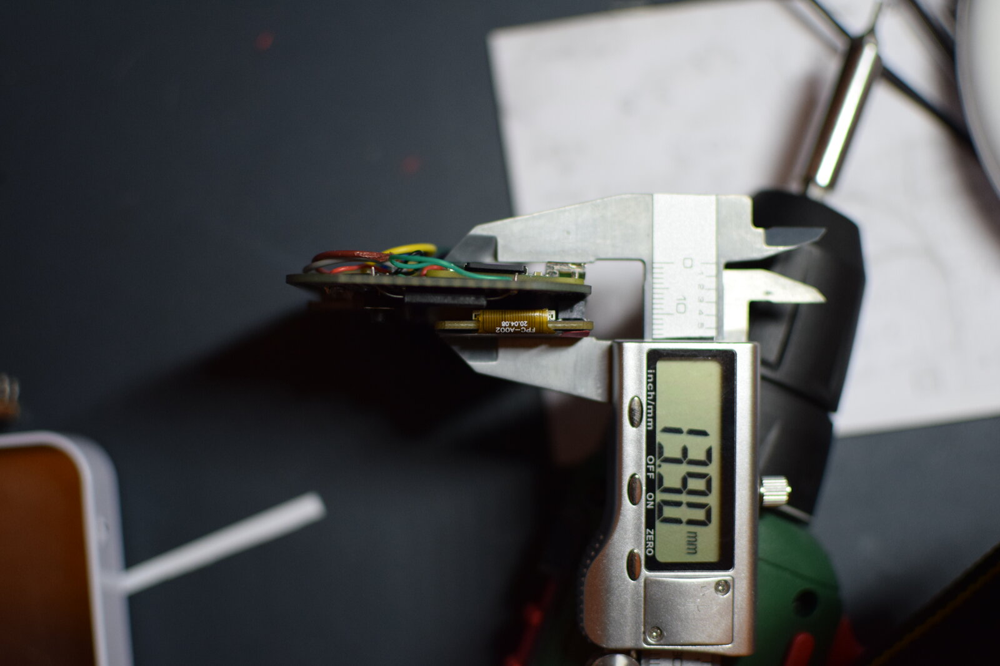</p>

*Figura 8: Misura con calibro digitale dell'ingombro su asse Z: 13.90 mm per lo stack (base + Raspberry + perfboard + schermo), ben sotto il limite di 22 mm della scatoletta.*

---

## 5. Modellazione e stampa 3D

L'idea di stampare delle parti in 3D c'è stata fin dall'inizio, per due benefici distinti (fissare il circuito in modo definitivo dentro la scatoletta e rendere il risultato esteticamente presentabile nascondendo il circuito sottostante). Una perfboard nuda con fili a vista dentro una scatoletta di latta è un prototipo, mentre con due cornici stampate diventa un oggetto.

I pezzi sono tre, e sono nel repository in `hardware/3d models/` in formato `.3mf`:

- Base: Cornice che appoggia sul fondo della latta, incollata con biadesivo. Solleva la board per farci stare la Raspberry e lascia dei fori per permettere l'avvitamento in fase di fissaggio.
- Topper: Cornice superiore con le aperture per lo schermo e per i quattro pulsanti. È il pezzo estetico: copre cablaggi e saldature lasciando emergere solo ciò che serve. Qua i fori servono per infilarci dentro le viti.
- Cover: Guscio esterno che avvolge la latta. Non fa parte del dispositivo finito, serve come maschea di foratura.

Come per lo schema elettrico, avendo competenze nulle in materia ho scelto il software Onshape (<https://onshape.com>), un CAD parametrico che gira nel browser.

La modellazione è stata prima di tutto una fase di misura: ho usato un calibro digitale per rilevare dimensioni e distanze reciproche di ogni componente (area visibile del pannello, posizione dei quattro pulsanti rispetto al bordo della board, quota della fessura del lettore SD, posizione delle prese micro-USB). Il metodo di costruzione base è stato principalmente il seguente: schizzo sul piano frontale con la geometria delle aperture e dei contorni, seguito da estrusioni additive per generare il materiale della cornice e sottrattive per ricavare fori e finestre.

Il pezzo più complicato è stato il topper, per un motivo che deriva da una scelta fatta a monte: i pulsanti tattili 6 × 6 × 6 mm sono più bassi della superficie dello schermo, quindi il topper non poteva essere una lastra piana e ha richiesto una sorta di gradino, con la zona dello schermo su un piano e quella dei pulsanti su un piano più basso. Quel gradino ha avuto una conseguenza in stampa, perché la faccia dei pulsanti aveva del vuoto sottostante. Il topper è stato quindi stampato con supporti (è l'unico dei tre pezzi che ne ha bisogno) e la sua superficie risulta meno uniforme, richiedendo una rifinitura a mano con cutter e carta abrasiva.

La stampa è stata affidata a un amico che ha messo a disposizione la sua stampante, una Bambu Lab H2D con nozzle standard da 0,4 mm. Il materiale scelto è PLA Basic bianco di eSUN, conservato in AMS che lo mantiene a temperatura ambiente ed essicca l'umidità in maniera passiva. Il colore bianco è stato scelto per richiamare il bianco del pannello e-paper e la parte inferiore della scatoletta.

Dei tre pezzi, solo il topper ha richiesto i supporti, generati in modalità automatica con strategia tree, a causa del gradino descritto sopra; base e cover sono stati stampati senza supporti. Il consumo indicativo di filamento è di 19 g per il topper e 8 g complessivi per gli altri due pezzi.

<table>
<tr>
<td style="width:33%; text-align:center; vertical-align:top;">

<br><em>Figura 9a: Base — 4 pilastrini, solleva la board per il Raspberry.</em>
</td>
<td style="width:33%; text-align:center; vertical-align:top;">
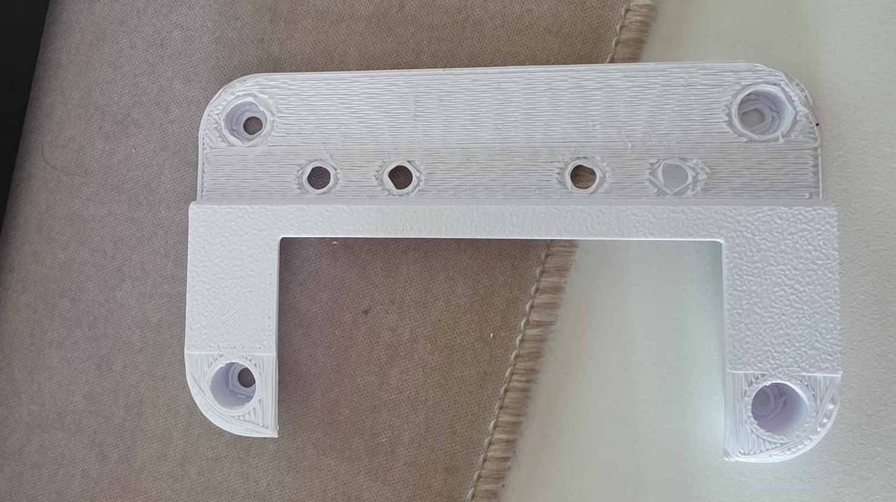
<br><em>Figura 9b: Topper — finestra e-paper + 4 fori pulsanti, gradino visibile.</em>
</td>
<td style="width:33%; text-align:center; vertical-align:top;">
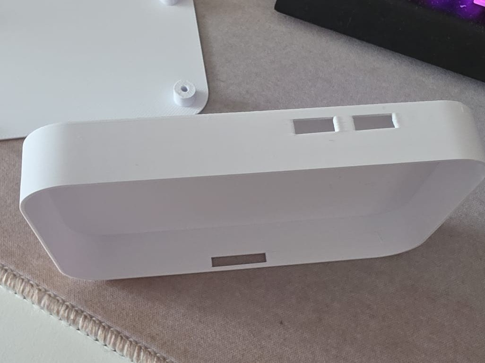
<br><em>Figura 9c: Cover — guscio esterno maschera di foratura.</em>
</td>
</tr>
</table>

Una nota che non è tecnica ma fa parte del progetto: avendo a disposizione nove scatolette Amarelli diverse, la scelta di quale usare non era ovvia, così ho coinvolto amici e parenti in una votazione. Ha vinto la più classica, ovvero la numero 1:

<p align="center">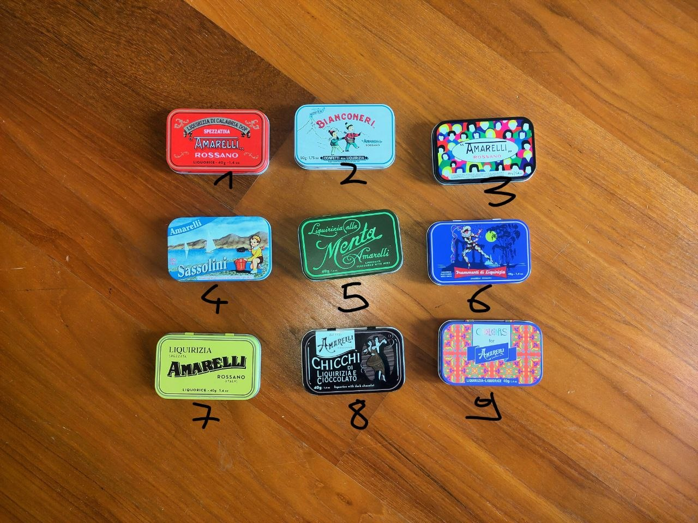</p>

*Figura 10: Le nove scatolette Amarelli candidate numerate 1-9. La votazione tra amici e parenti ha premiato la n.1, la più classica (rossa).*

---

## 6. Software

### 6.1 Configurazione del Raspberry

Il sistema operativo è Raspberry Pi OS Lite (32 bit), senza desktop, perché gni servizio grafico è sprecato.

Tutta la configurazione è automatizzata in `install.sh`.. Lo script è idempotente, quindi rieseguirlo non rompe nulla e serve anzi come strumento di riparazione. Oltre a installare le dipendenze necessarie e configurare il progetto fa le seguenti operazioni.

Prima fra tutte il riconoscimento del lettore SD, oltre ad attivare SPI (`dtparam=spi=on`), fa riconoscere al kernel una scheda SD su SPI richiedendo un device tree overlay dichiarando che sul secondo chip-select di SPI0 c'è uno slot SD:

```
dtoverlay=anyspi,spi0-1,dev=mmc-spi-slot,speed=10000000
```

Con questa riga in `config.txt` il sistema espone entrambi i device (`/dev/spidev0.0` per il display, `/dev/spidev0.1` per il lettore) e la scheda della fotocamera compare come `/dev/mmcblk1`.

Poi per quanto rigurda il driver Waveshare per il display, che come da documentazione viene clonato da GitHub. L'installer lo scarica, applica con `sed` la modifica del pin di reset da BCM 17 a BCM 27 (vedi paragrafo 3.2) e lo copia nel virtualenv.

Infine è l'avvio automatico, gestito da un'unit systemd generata da un template sostituendo utente e percorsi reali. Un dettaglio: `KillSignal=SIGINT` fa sì che systemd non termini il processo brutalmente ma gli mandi un SIGINT, che in Python diventa una `KeyboardInterrupt` e risale fino al blocco `finally` di `main.py` (che spegne il LED, smonta la scheda, chiude i GPIO e manda l'e-paper in sleep con un refresh completo). pannello con un'immagine fantasma e il LED acceso.

### 6.2 Ambiente di sviluppo

Il codice è scritto in python, le dipendenze sono in `pyproject.toml`, con quelle specifiche del Raspberry (`spidev`, `lgpio`, `RPi.GPIO`, `rpi_ws281x`) isolate in un extra opzionale, così l'installazione funziona anche su un PC dove quei pacchetti non si compilerebbero.

Lo sviluppo è avvenuto prevalentemente su un laptop, con git come mezzo di sincronizzazione verso il dispositivo e all'occorrenza sshfs per fare modifiche dirette quando serviva provare qualcosa sull'hardware senza passare da un commit. I segreti (credenziali WebDAV e password dell'access point) sono in un file `.env` fuori da git, mentre la configurazione non sensibile è in `config.json`.

### 6.3 Architettura

Il software è organizzato in moduli con responsabilità singole, tutti in `software/`, in seguito lascio una breve descrizione di ogni modulo:

```
main.py         orchestrazione: avvio, event loop, collegamento dei pezzi
backup.py       macchina a stati della pipeline di backup
cache.py        copia dalla SD alla cache locale, pruning
uploader.py     pipeline di upload astratta, con i backend webdav_uploader e rclone_uploader
database.py     accesso a SQLite (models.py contiene la dataclass FileRecord)
sdcard.py       rilevamento e mount della scheda della fotocamera
display.py      rendering e-paper: viste, composizione, refresh
menu.py         albero di menù e navigazione
led_status.py   stato -> colore del LED
keylistener.py  input: pulsanti GPIO o tastiera, più il reed switch
eventbus.py     bus di eventi pub/sub
config.py       configurazione (config.json e .env), persistenza
wifi.py         access point, scansione e connessione via nmcli
flask_app.py    pagina web di configurazione
```

Il principio organizzativo è che la logica di backup non sa nulla dell'interfaccia, e viceversa: `backup.py` non importa `display.py` né `led_status.py`, ma pubblica eventi e chi è interessato reagisce.

In seguito illustro i design pattern usati nel progetto.

Macchina a stati, in `backup.py`, che è il pattern portante. Un enum con nove stati (`IDLE`, `CACHING`, `UPLOADING`, `REMOTE_CLEANUP`, `PRUNING`, `COMPLETED`, `PAUSED`, `RETRYING`, `ERROR`) e una lista dichiarativa di fasi, dove ogni voce dice quale metodo chiamare su quale oggetto:

```python
_PHASES = [
    (State.CACHING,        "_cache",    "copy"),
    (State.UPLOADING,      "_uploader", "upload"),
    (State.REMOTE_CLEANUP, "_uploader", "cleanup_remote"),
    (State.PRUNING,        "_cache",    "prune"),
]
```

Il motore itera sulla lista, salta le fasi non pertinenti alla modalità corrente e gestisce in un unico punto retry, pausa ed errori. Il vantaggio è che la ripresa dopo una pausa diventa banale: si memorizza lo stato da cui si è usciti, si cerca il suo indice e si riparte da lì.

Repository, in `database.py`, che incapsula tutto SQLite: nessun altro modulo scrive SQL, ma chi ha bisogno di dati chiama metodi il cui nome descrive l'intenzione (`find_pending_uploads()`, `mark_uploaded()`) e riceve oggetti `FileRecord`.

Event bus, in `eventbus.py`, con implementazione minimale (un dizionario evento/handler, un `on()` e un `emit()`). Un dettaglio che si è rivelato importante è che `emit()` racchiude ogni handler in un `try/except` che logga l'eccezione senza propagarla, quindi un bug nel rendering non può interrompere un backup in corso: per un dispositivo di backup è la priorità giusta. Gli eventi in circolazione riguardano i cambi di stato (`backup:state`), l'avanzamento sui singoli file (`file:cached`, `file:uploaded`), l'input (`key:press`), le modifiche di configurazione (`config:set`) e il rendering (`ui:redraw`, `menu:opened`).

Template method con strategy e factory, in `uploader.py`. La classe astratta `Uploader` implementa una volta sola tutta la logica comune a qualsiasi destinazione (ciclo sui file pendenti, creazione delle directory remote, aggiornamenti del database, statistiche, classificazione degli errori), mentre le sottoclassi implementano solo tre metodi primitivi: `ensure_remote_dir()`, `put()` e `delete()`.

Composite, nel menù, che è un albero di `MenuItem` dove ogni nodo può avere figli. Le voci del menù principalmente modificano un'impostazione in questo modo: il nodo padre porta la chiave di configurazione e i figli portano il valore, quindi selezionare un figlio significa scrivere quella chiave con quel valore, senza scrivere codice per ogni singola impostazione.

### 6.4 I componenti principali

Il database è un solo file SQLite con una sola tabella, dove ogni riga è un file visto sulla scheda. L'idea che tiene insieme tutto è che lo stato di un file è dedotto dai timestamp (`cached_at`, `uploaded_at`, `pruned_at`) e non memorizzato in una colonna "stato" da mantenere coerente: `cache_path` valorizzato con `uploaded_at` nullo significa "in attesa di upload", e così via. È questo che rende il dispositivo idempotente e resistente alle interruzioni, perché se si spegne a metà upload alla riaccensione i file già caricati non vengono ritoccati e gli altri riprendono, senza nessuna logica di ripristino. Sulla chiave di unicità ho cambiato idea a metà progetto: all'inizio era sull'hash del contenuto, che sembrava sensato, ma causava molti rallentamenti in fase di caching, quindi ho optato per definire l'unicità del file sul percorso di origine.

La cache è il modulo dedicato alla copia dei file in locale. Prima di copiare, il modulo confronta dimensione e mtime con il record nel database e salta i file già a posto senza leggerli. Il pruning, infine, cancella le copie locali secondo una politica configurabile (subito, dopo 7 giorni, dopo 30, mai) con una regola ferrea: si cancella solo ciò che risulta già caricato.

Gli uploader sono due. WebDAV usa `webdavclient3`, e l'unico punto non ovvio è che WebDAV non ha un `mkdir -p`, quindi la creazione delle directory cammina sui componenti del percorso creando quelli mancanti. Rclone invoca il binario esterno via `subprocess` con tre comandi (`mkdir`, `copyto`, `deletefile`), e appoggiarsi a rclone è stata una scelta obbligata perché implementare un uploader per ogni servizio a mano sarebbe stata improponibile. Viene invocato con `--retries 1`, cioè disabilitando il suo meccanismo di retry, perché i retry devono stare in un solo posto (la macchina a stati, che è l'unica che sa mostrare "Retrying..." sullo schermo, far lampeggiare il LED e rispettare una richiesta di pausa).

Attraverso entrambi i backend passa la distinzione fra errori transitori e permanenti, che determina il comportamento visibile: un errore transitorio fa riprovare con backoff esponenziale (5, 10, 20 secondi), uno permanente ferma il backup e chiede all'utente di intervenire. La classificazione avviene su parole chiave nel messaggio (`401`, `403`, `invalid credentials`) e, per rclone, sugli exit code che non migliorano con un retry.

Il rilevamento della scheda usa `lsblk --json` e parte da `mmcblk1`, perché `mmcblk0` è la scheda di sistema, e distingue due domande che all'inizio confondevo (se il device esiste, che serve all'interfaccia per mostrare la scheda come presente appena la si infila, e se è montato e leggibile, che serve alla logica di backup). Il mount ha anche un'attesa esplicita del device node dopo `udevadm settle`, perché fra il momento in cui il kernel riconosce la scheda e quello in cui il nodo è utilizzabile passa un tempo non nullo, e su SPI è più lungo che su un lettore nativo: senza questa attesa il mount fallisce in modo intermittente, che è il tipo di bug peggiore da diagnosticare.

Il display funziona per composizione: si crea un'immagine Pillow a un bit per pixel di 250 × 122, e sopra scrivono tre livelli (la status bar in alto, la vista attiva al centro, la legenda in basso). Le frecce contenute nella legenda sono disegnate come poligoni e non scritte come caratteri, perché il font di default non ha i glifi Unicode dei triangoli e su un pannello a 1 bit un carattere mancante diventa un rettangolo vuoto. Sulla gestione del pannello ci sono due accorgimenti nati da altrettanti problemi reali. Il primo frame usa l'inizializzazione completa e i successivi la modalità veloce, che è molto più rapida ma accumula ghosting, con un refresh completo rieseguito all'uscita dell'applicazione.

E i redraw sono coalescati, perché gli eventi di avanzamento arrivano a raffica (uno per file copiato) e ridisegnare a ogni evento accoderebbe centinaia di refresh lasciando lo schermo sempre indietro: le viste quindi non disegnano ma alzano un flag, e l'event loop esegue al massimo un refresh per ciclo.

Il LED traduce lo stato in un colore più un flag di lampeggio:

| Colore | Stato |
|---|---|
| Bianco | avvio |
| Verde | pronto, oppure completato |
| Giallo | in attesa di una scheda |
| Blu | copia nella cache (lampeggia) |
| Ciano | upload (lampeggia) |
| Magenta | pulizia del remoto o pruning (lampeggia) |
| Arancione | in pausa (fisso) o in retry (lampeggia) |
| Rosso | errore |

Il criterio della codifica è che il lampeggio significa "sto lavorando" e il colore fisso "sto aspettando te, o ho finito". A scatoletta chiusa questo basta per sapere se si può mettere via il dispositivo, che era esattamente il requisito. Il lampeggio gira su un thread dedicato, perché legarlo all'event loop lo renderebbe irregolare (e un LED che lampeggia in modo irregolare sembra un guasto).

Per l'input ci sono due implementazioni della stessa interfaccia: quella GPIO usa `gpiozero.Button` con debounce di 50 ms delegato alla libreria, quella da terminale legge la tastiera in raw mode e decodifica le sequenze di escape delle frecce (ed è ciò che permette di pilotare l'interfaccia da PC in mock). Il reed switch è a parte perché non è un tasto ma uno stato, quindi espone sia una lettura immediata (usata all'avvio, per non accendere lo schermo se il dispositivo parte già chiuso) sia una coda di transizioni.

### 6.5 Un caso d'uso completo

Vale la pena seguire una volta l'intero percorso, da quando l'utente preme Conferma a quando la foto è sul cloud.

La pressione chiude BCM 19 verso massa, `gpiozero` applica il debounce e il callback deposita il tasto in una coda. L'event loop lo estrae e pubblica `key:press`, e l'handler decide in base a due cose (quale vista è attiva e in quale stato è il backup): con la vista di stato attiva e il backup in `IDLE`, il tasto destro significa "avvia".

Prima di avviare, in modalità manuale viene ritentato il mount, perché il caso normale è che l'utente accenda il dispositivo e poi infili la scheda. Se il mount riesce si istanzia la cache e la si passa al backup, e se non riesce ma il database contiene file pendenti il backup parte comunque, perché si può caricare senza scheda.

`Backup.start()` congela le impostazioni in vigore (un cambio di configurazione a metà backup non produce comportamenti misti), passa a `CACHING` e lancia il thread della pipeline. La fase di cache attraversa la scheda, filtra per estensione, confronta con il database, copia a chunk sul file temporaneo, fa il rename atomico e scrive il record, emettendo un evento per ogni file. Ogni evento raggiunge la vista di stato, che incrementa i contatori e avanza la barra, e in parallelo il LED è già passato a blu lampeggiante perché aveva ricevuto il cambio di stato.

La fase di upload recupera i pendenti dal database e per ciascuno calcola il percorso remoto preservando la struttura di cartelle, poi chiama il backend. Al successo il file viene marcato come caricato, al fallimento viene incrementato il contatore dei tentativi ma il file resta pendente, così il tentativo successivo lo riprende. Se la rete cade si passa a `RETRYING`, con LED arancione lampeggiante e attesa a backoff esponenziale spezzettata in intervalli da 50 ms (così una richiesta di pausa viene comunque raccolta subito), e dopo tre tentativi si va in `ERROR`.

Segue poi il pruning delle copie locali (in modalità upload) o la pulizia del remoto (in modalità mirror, dove i file non più presenti sulla scheda vengono rimossi anche dal cloud): le due fasi sono mutuamente esclusive per costruzione. Alla fine si passa a `COMPLETED` con le statistiche aggregate e lo stato "Done".

Il percorso di una modifica di configurazione è più corto ma mostra bene il ruolo dell'event bus. Selezionando un valore nel menù viene emesso `config:set`, e quel singolo evento scatena reazioni in quattro punti diversi: `Config` riscrive `config.json` su disco (quindi l'impostazione sopravvive a un riavvio), `Backup` intercetta la modalità upload/mirror e la applica al backup successivo e `main` ricostruisce l'uploader se è cambiato il backend.

### 6.6 Modalità mock e pagina web

Il flag `--mock` sostituisce l'hardware con dei sostituti software (uno schermo che accetta tutte le chiamate senza fare nulla, la tastiera invece dei pulsanti, il reed switch disattivato, il LED in modalità log) e stampa su stdout la vista corrente in forma testuale a ogni refresh:

```
[DISPLAY] BACKUP | Liquorice | Caching files... (CACHING) | wifi:ON sd:ON | cached:12 pend:12 up:0 bar:12/40 file:IMG_0042.JPG
```

Combinato con l'opzione "Fake SD" del menù (che legge da una cartella locale invece che dal lettore SPI) e con la possibilità di usare una cartella locale come destinazione rclone, permette di eseguire l'intera pipeline su un PC senza avere fisicamente a disposizione la raspberry. È ciò che ha reso possibile sviluppare l'interfaccia senza avere il dispositivo sottomano.

Il modulo `wifi.py` gestisce la rete tramite `nmcli`: sa creare un access point con SSID e password prese dal `.env`, scansionare le reti, connettersi e dimenticare una rete. Sopra questo c'è un captive portal (un piccolo server DNS che risponde a qualsiasi query con l'indirizzo del dispositivo, più i tipici endpoint di rilevamento usati da Android e iOS), il cui effetto è che collegandosi alla rete del dispositivo il telefono apre da solo la pagina di configurazione, senza che l'utente debba conoscere o digitare un indirizzo IP. La pagina, servita da Flask sulla porta 5000, permette di scegliere la rete Wi-Fi, modificare tutte le impostazioni del menù (più alcune che sul menù non ci stanno, come il remoto rclone) e leggere i log. Le modifiche passano dallo stesso evento `config:set`, quindi menù e pagina web sono due interfacce sullo stesso meccanismo e non possono divergere.

Va detto che il server web è in ascolto su `0.0.0.0:5000` senza autenticazione e in HTTP, quindi chiunque sia sulla stessa rete può cambiare la configurazione del dispositivo e leggerne i log. Sull'access point del dispositivo, protetto da password WPA, il rischio è contenuto, ma su una rete condivisa non lo è. Per questo motivo ho scelto di renderlo dispobile solo se

Il logging accompagna tutto (console a livello INFO e file a livello DEBUG, più l'output del servizio via `journalctl`), ed è utile sia in modalità mock, perché rende evidente ciò che accade, che in modalità normale per poter risalire ad eventuali errori.

---

## 7. Sviluppi futuri

Ci sono diversi aspetti migliorabili in questo progetto.

La batteria è il primo punto, e quello che manca al progetto per essere davvero autonomo. Il PowerBoost 1000C c'è già, quindi il lavoro da fare è capire perché il Raspberry si riavvia: misurare la tensione sul rail 5 V durante i picchi, aggiungere capacità di bulk vicino al carico e verificare se il problema si sposta. Da aggiungere poi il fuel gauge MAX17043 su I²C, già testato con successo, per mostrare lo stato di carica sullo schermo.

I pulsanti più alti sono una modifica a costo quasi nullo che semplifica due fasi del progetto: i 6 × 6 × 6 mm scelti sono più bassi dello schermo, e questo ha generato il gradino nel topper che è stato il problema principale della modellazione e della stampa (vedi capitolo 5). Con pulsanti più alti il topper diventerebbe una lastra piana, stampabile senza supporti e con una superficie migliore.

Il PCB migliorerebbe la riproducibilità. Allo stato attuale il progetto non è difficile da ripetere (la wiki riporta tutte le posizioni riga/colonna sulla perma-proto e i test hardware permettono di verificare ogni collegamento prima di chiudere la scatoletta), ma resta una quantità di saldature a mano che con un PCB sparirebbe del tutto, insieme al rischio di errore che portano con sé. Lo schema EasyEDA c'è già, e ora che il circuito è validato sul campo il rischio principale del PCB, cioè sbagliare in modo irreversibile, è molto ridotto.

L'interfaccia ha margini di miglioramento: il pannello 250 × 122 a un bit è sfruttato in modo essenziale, e ci sarebbe spazio per icone dedicate, un'indicazione dei tempi stimati e una gestione più fine dei refresh parziali per aggiornare solo la barra di avanzamento invece di tutto lo schermo.

Sul server web servirebbe un'autenticazione: anche una semplice basic auth con credenziali nel `.env` alzerebbe sensibilmente la barriera, ed è il minimo prima di consigliare a qualcuno di lasciare il server attivo su una rete non propria.

---

## 8. Conclusioni

Il dispositivo funziona e fa quello che doveva fare: si infila la scheda, si preme un tasto (o non si preme niente, in modalità automatica), le foto finiscono nella cache locale e poi sul cloud, senza mai duplicare un upload e senza bisogno di un computer. I tre requisiti iniziali sono soddisfatti, perché si può usare a scatoletta chiusa seguendo il LED, non serve una rete già configurata e ogni impostazione è raggiungibile dal menù o dalla pagina web senza aprire un terminale.
