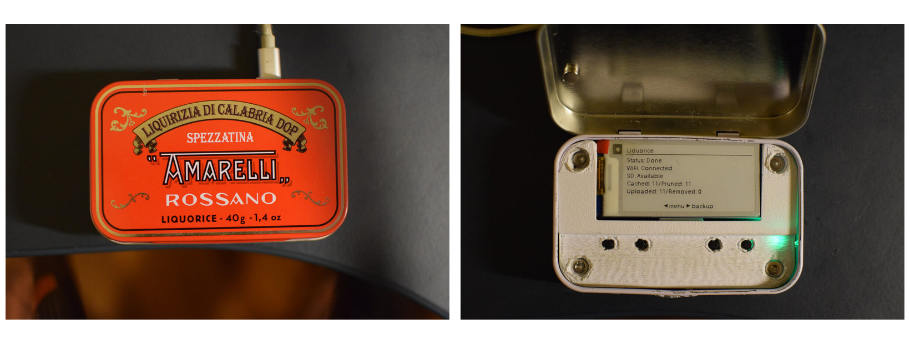
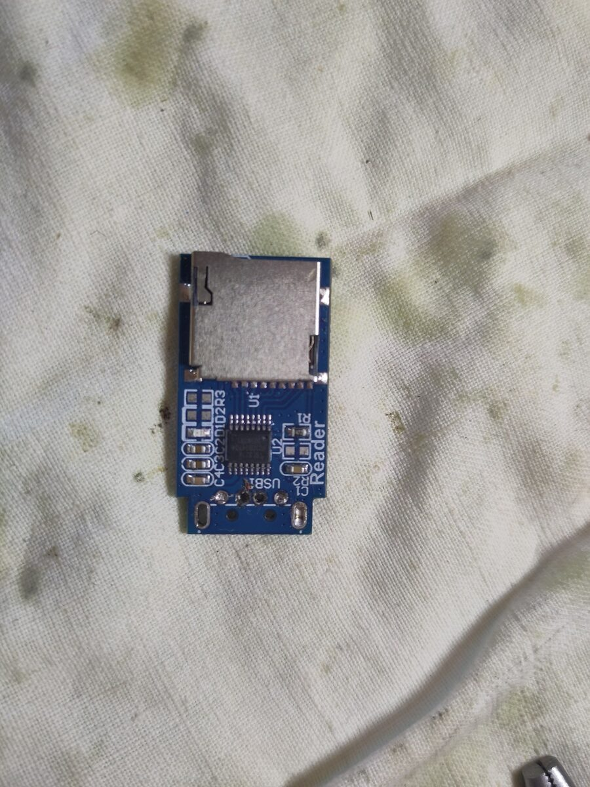
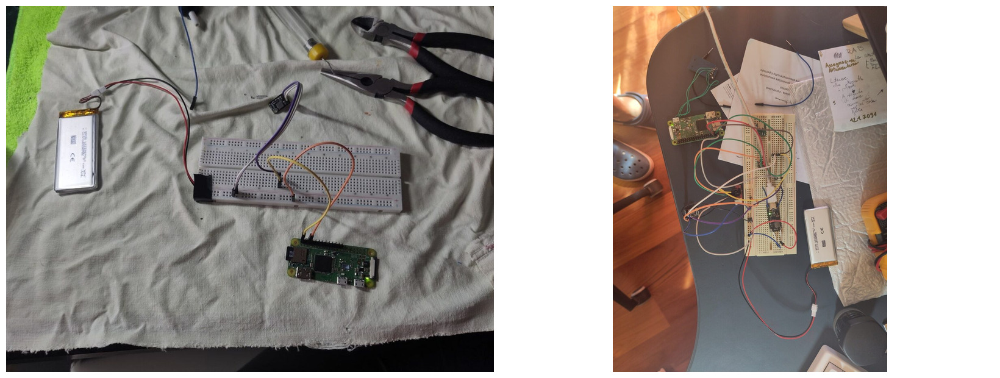
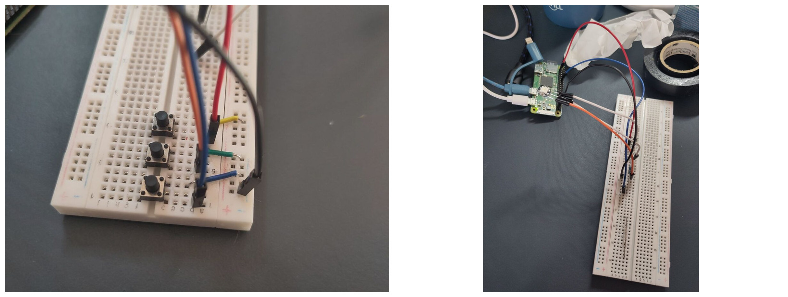
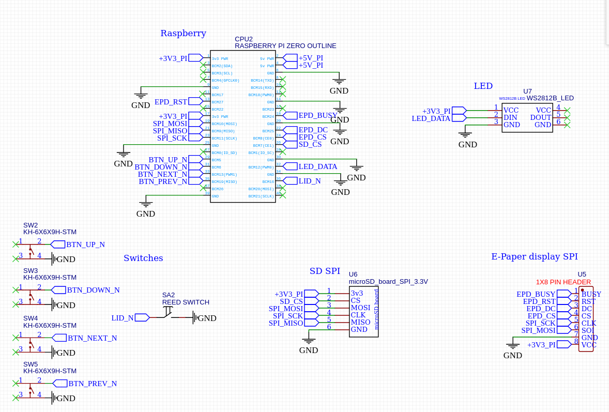
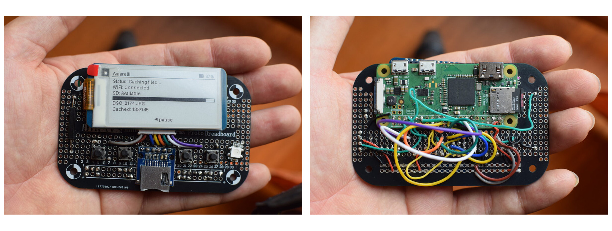
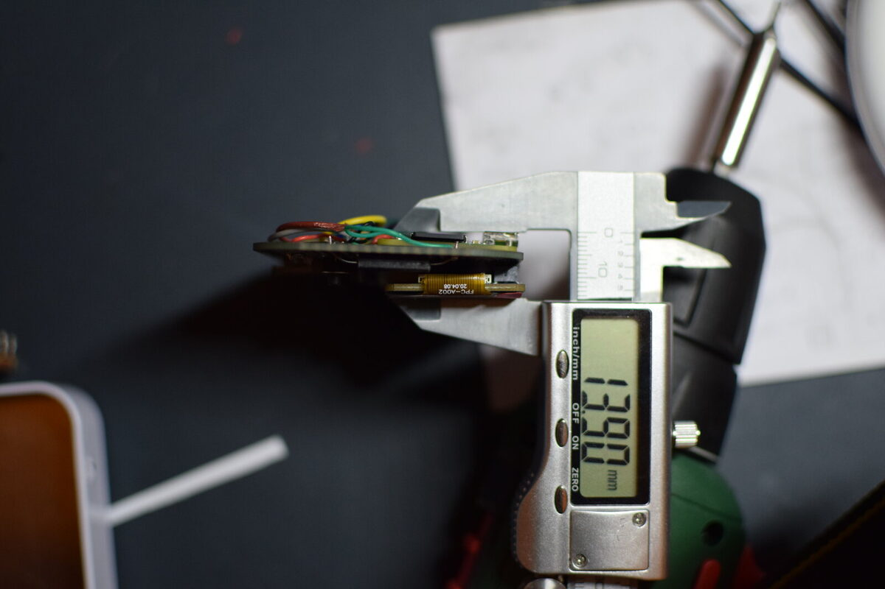
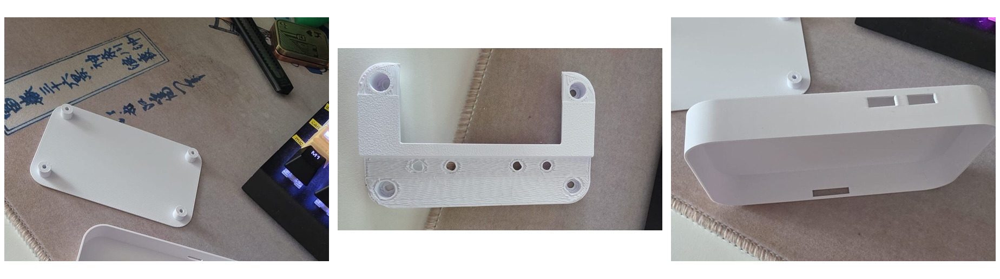
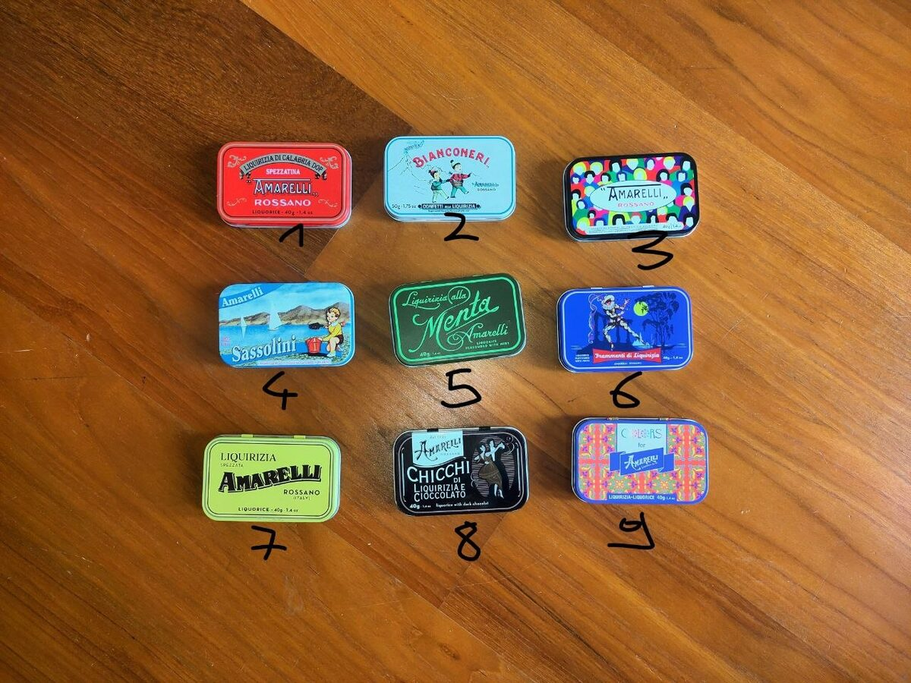

# Indice

- Introduzione: idea e requisiti
- Hardware: scelte per esclusione
- Breadboard e circuito
- Assemblaggio
- Modellazione e stampa 3D
- Software: architettura e componenti
- Sviluppi futuri
- Conclusioni

# Il dispositivo



# 1. Introduzione

# 1. Cos'è

- Scatoletta di latta Amarelli → dispositivo di backup fotografico
- microSD della fotocamera nel lettore sul fianco
- Cache locale immediata → upload sul cloud in background
- Database: mai due volte lo stesso file
- Due passaggi indipendenti
    - cache: non serve Internet
    - upload: non serve la SD
- Interfaccia: e-paper 2.13", 4 pulsanti, LED RGB, pagina web
- Relazione sul *perché* delle scelte, strade sbagliate incluse

# 1.1 L'idea

- Problema reale: in vacanza fotocamera sì, portatile no
- Foto per giorni in un solo posto: la SD nella fotocamera
- Soluzioni commerciali: costose, chiuse, legate all'ecosistema
- Nessun equivalente DIY open source
- Secondo ingrediente: collezionista involontario di scatolette Amarelli

# 1.1 Dalla scatoletta al formato standard

- Amarelli ≈ 94 × 60 × 22 mm = standard di fatto delle mint tin (Altoids)
- Conseguenza 1: progetto universale, qualsiasi mint tin va bene
- Conseguenza 2: esistono componenti per quel formato
    - Mint Tin Sized Perma-Proto Breadboard
- Ispirazione: MintyPi di sudomod (Altoids + retrogaming)
- Divergenza: MintyPi usa un PCB su misura, qui perfboard cablata a mano

# 1.2 Requisiti

1. Usabile a scatoletta chiusa → LED RGB + modalità automatica
2. Nessuna rete Wi-Fi già configurata → cache/upload separati, access point proprio
3. Minimizzare gli accessi SSH → menù a bordo + pagina web

- Non sono desiderata: hanno determinato le scelte implementative

# 2. Hardware

# 2.1 Raspberry Pi Zero W

- Raspberry: notorietà e documentazione disponibile
- Modello scelto per esclusione
    - Pi 3/4/5: 85 × 56 mm, connettori oltre i 22 mm utili
    - Pico: microcontrollore, no OS, no filesystem, no rclone/SQLite, RAM
    - Compute Module 4/5: System-on-Module, no header 40 pin
- Zero: 65 × 30 mm, header 40 pin, Wi-Fi integrato (requisito, non extra)
- Zero W vs Zero 2 W: prezzo → Zero W
- GPIO e dimensioni identici: funziona anche con Zero 2 W

# 2.2 Il problema della seconda scheda

- Un solo slot microSD, occupato dal sistema operativo
- Strada 1: saldare sui pad dello slot SD del Pi
    - provata materialmente, non funziona
    - bus SDIO: una scheda sola, già occupata dal boot
- Strada 2: adattatore USB-microSD cannibalizzato
    - 4 pad (VBUS, GND, D+, D−) → PP1, PP6, P22, P23
    - SD non rilevata dal Raspberry → scartata

# 2.2 Il tentativo USB cannibalizzato



# 2.2 La soluzione: lettore microSD su SPI

- Modulino a sei pin sul bus SPI0
- Driver kernel `mmc_spi` → `/dev/mmcblk1`, device a blocchi normale
- Vantaggio non previsto: il meno esoso in corrente
    - con i problemi di alimentazione, l'USB non avrebbe tenuto
- Prezzo: velocità ridotta → più tempo per la copia locale
    - accettabile, il collo di bottiglia percepito è l'upload
- Bus SPI0 condiviso con lo schermo
    - display su CE0 (BCM 8), lettore su CE1 (BCM 7), MOSI e CLK in comune

# 2.3 E-paper contro LCD

- LCD: reattivo, colore, economico — ma consumo continuo
- E-paper: bistabile, consuma solo al refresh
    - stato che cambia poche volte al minuto → profilo ideale
    - leggibile in pieno sole
    - contro: refresh nell'ordine dei secondi, bianco e nero puro
- Interazione limitata → i contro non sono critici

# 2.3 Waveshare 2.13" e-Paper HAT (V4)

- 250 × 122 px, monocromatico 1 bit, controller SSD1680, SPI
- Dimensioni verificate sui limiti della lattina
- HAT preso per semplicità, ma connettore 40 pin non usato
    - impilarlo consumava tutta l'altezza disponibile
- Usato il connettore laterale a 8 fili, terminazioni femmina tagliate

# 2.4 Pulsanti

- 4 pulsanti tattili 6 × 6 × 6 mm, fra GPIO e massa
- Economici e reperibili
- Da 2 a 4: conseguenza del requisito "no SSH"
    - tutte le impostazioni modificabili a bordo → menù navigabile
- Su, giù, indietro, conferma = costo minimo per un'interfaccia decente

# 2.4 LED e reed switch

- Servono il requisito "scatoletta chiusa": schermo e pulsanti presuppongono il coperchio aperto
- LED WS2812B indirizzabile
    - molti stati da rappresentare → codifica per colore + lampeggio
- Reed switch + magnete incollato al coperchio
    - chiusura → schermo in sleep, nessun refresh inutile
    - primo errore: reed in ampolla di vetro, rotti piegando i terminali
    - sostituiti con la versione in plastica

# 2.5 Alimentazione: il tentativo fallito

- Risultato finale: nessuna batteria, alimentazione micro-USB
- È la mancanza più grande del progetto
- Batteria individuata: LiPo 803450 1500 mAh (50,7 × 34 × 8 mm)
- Tentativo 1: boost TPS61023 + caricatore LiPo separato
    - nessun power path
    - batteria sorgente e destinazione insieme → inutilizzabile sotto carica

# 2.5 Secondo tentativo e rinuncia

- Adafruit PowerBoost 1000C: power path + boost TPS61090 + segnale batteria scarica
- Test iniziali ok; con software completo il Pi si riavviava
- Nessuna diagnosi definitiva, solo ipotesi
    - picchi di corrente: Wi-Fi + refresh schermo + lettura SD + LED
- MAX17043 (fuel gauge I²C) testato con successo
- Scelta: consegnare un dispositivo affidabile via USB
- Effetto collaterale positivo: spazio libero in altezza

# 2.5 I test di alimentazione



# 3. Breadboard e circuito

# 3.1 Prototipazione su breadboard

- Punto di partenza: competenza elettronica bassa
- Strategia: un componente alla volta, un test ad hoc per ognuno
    - verificare di aver capito i collegamenti
    - escludere guasti fisici
- I test sono rimasti nel repository: `software/tests/hardware/`
- Diventati strumento diagnostico permanente
    - problema nel dispositivo assemblato → cablaggio o software?

# 3.1 I test sui componenti



# 3.2 Lo schema elettrico

- Disegnato con EasyEDA: gira nel browser, curva di apprendimento bassa
- Non fili ma net label: stessa etichetta = connessione elettrica
- Nota su RST: la documentazione Waveshare usa BCM 17
    - sul mio Raspberry quel pin è danneggiato → spostato su BCM 27
    - patch applicata automaticamente dall'installer

# 3.2 Schema



# 3.2 I collegamenti

| Componente | Interfaccia | Pin (BCM) |
|---|---|---|
| Display e-paper | SPI0, CE0 | DIN 10, CLK 11, CS 8, DC 25, RST 27, BUSY 24 |
| Lettore microSD | SPI0, CE1 | MISO 9, CLK 11, MOSI 10, CS 7 |
| Pulsanti | GPIO pull-up | Left 5, Down 6, Up 13, Right 19 |
| LED WS2812B | PWM0 hardware | DIN 12 |
| Reed switch | GPIO pull-up | 16 |

# 3.3 Perfboard contro PCB

- PCB: dimensioni al millimetro, nessun cablaggio, risultato professionale
    - errore irrecuperabile, alta probabilità di errore, costo con spedizione
- Perfboard: ogni errore recuperabile dissaldando, pochi euro
    - prezzo: cablaggio manuale lungo e delicato
- Scelta facilitata dalla Mint Tin Sized Perma-Proto Breadboard
    - piste pre-stampate riga/colonna, formato mint tin esatto
    - entra senza tagli; rotaie `+`/`−` distribuiscono alimentazione e massa

# 4. Assemblaggio

# 4.1 Disposizione dei componenti

- Risultato di vincoli sovrapposti; vista dall'alto simmetrica
- Schermo in alto, 4 pulsanti in linea sotto
    - ordine vim: indietro, giù, su, conferma
- LED e reed in alto, sulle colonne isolate della perma-proto (0 e 32)
    - LED affacciato al foro sulla latta, reed vicino al magnete
    - fori non condivisi → nessuna interferenza di segnale
- Lettore SD in alto: orientato perché la scheda entri diritta nel fianco

# 4.1 Il Raspberry

- Parte inferiore, capovolto sulla faccia posteriore della board
- Header saldato dal lato inferiore, bordo superiore allineato a quello della board
- Vincolo: la micro-USB deve essere raggiungibile dall'esterno
- A posteriori: senza batteria si poteva ruotare il Pi e appoggiarlo sul fondo
    - micro-USB non ruotata, come fatto con il lettore SD

# 4.2 Saldature e cablaggio

- Non saldati ma biadesivo 3M 5952 VHB: Raspberry e schermo
    - i pezzi più costosi, gli unici da recuperare → smontaggio non distruttivo
- Tutto il resto saldato, con header a pettine come supporto
- Schermo ↔ Pi: la parte più laboriosa, facce opposte della board
    - terminazioni femmina tagliate, fili passati nei fori
    - segnali dedicati (CS, DC, RST, BUSY) → pin del Raspberry
    - segnali condivisi (MOSI, CLK) → colonna del lettore SD, via piste
    - VCC/GND dalle rotaie, da pin 1 (3,3 V) e pin 39 (GND)

# 4.2 Accortezze

- Tutto il cablaggio sul retro → faccia anteriore pulita, topper in piano
- Prima di dare tensione: multimetro
    - continuità delle rotaie
    - assenza di corti fra pin adiacenti, in particolare 5 V contro 3,3 V

# 4.2 Il cablaggio



# 4.2 Ingombro sull'asse Z



# 5. Modellazione e stampa 3D

# 5. Perché stampare in 3D

- Due benefici distinti
    - fissare il circuito in modo definitivo dentro la scatoletta
    - nascondere il circuito → risultato presentabile
- Perfboard nuda con fili a vista = prototipo
- Con due cornici stampate = oggetto

# 5. I tre pezzi

- In `hardware/3d models/`, formato `.3mf`
- Base: appoggia sul fondo, incollata con biadesivo
    - solleva la board per far stare il Raspberry, fori per l'avvitamento
- Topper: aperture per schermo e 4 pulsanti
    - pezzo estetico, copre cablaggi e saldature
- Cover: guscio esterno, non fa parte del dispositivo
    - serve come maschera di foratura

# 5. Modellazione: metodo

- Competenze CAD nulle → Onshape: parametrico, gira nel browser
- Prima di tutto una fase di misura, con calibro digitale
    - area visibile del pannello
    - posizione dei 4 pulsanti rispetto al bordo
    - quota della fessura del lettore SD, prese micro-USB
- Costruzione: schizzo sul piano frontale
    - estrusioni additive per la cornice
    - estrusioni sottrattive per fori e finestre

# 5. Il topper: il pezzo difficile

- Conseguenza di una scelta a monte: pulsanti 6 × 6 × 6 mm più bassi dello schermo
- Non una lastra piana ma un gradino: schermo su un piano, pulsanti più in basso
- In stampa: vuoto sotto la faccia dei pulsanti
    - unico pezzo con supporti (automatici, strategia tree)
    - superficie meno uniforme → rifinitura a mano con cutter e carta abrasiva

# 5. La stampa

- Bambu Lab H2D, nozzle standard 0,4 mm (stampante prestata da un amico)
- PLA Basic bianco eSUN, conservato in AMS (temperatura ambiente, essiccazione passiva)
- Bianco per richiamare il pannello e-paper e il fondo della scatoletta
- Base e cover senza supporti
- Filamento: 19 g il topper, 8 g gli altri due

# 5. I pezzi stampati



# 5. La scelta della scatoletta



# 6. Software

# 6.1 Configurazione del Raspberry

- Raspberry Pi OS Lite 32 bit: ogni servizio grafico è sprecato
- Tutto automatizzato in `install.sh`
- Idempotente: rieseguirlo non rompe nulla, è anche strumento di riparazione
- Riconoscimento del lettore SD: `dtparam=spi=on` + device tree overlay

```
dtoverlay=anyspi,spi0-1,dev=mmc-spi-slot,speed=10000000
```

- `/dev/spidev0.0` display, `/dev/spidev0.1` lettore, scheda = `/dev/mmcblk1`

# 6.1 Driver e avvio automatico

- Driver Waveshare clonato da GitHub
    - patch `sed` del pin di reset BCM 17 → BCM 27
    - copiato nel virtualenv
- Unit systemd generata da un template (utente e percorsi reali)
- `KillSignal=SIGINT`: non termina brutalmente
    - SIGINT → `KeyboardInterrupt` → blocco `finally` di `main.py`
    - LED spento, scheda smontata, GPIO chiusi, e-paper in sleep con refresh completo

# 6.2 Ambiente di sviluppo

- Python, dipendenze in `pyproject.toml`
- Dipendenze hardware in un extra opzionale
    - `spidev`, `lgpio`, `RPi.GPIO`, `rpi_ws281x`
    - l'installazione funziona anche su PC
- Sviluppo su laptop
    - git come mezzo di sincronizzazione verso il dispositivo
    - sshfs per modifiche dirette senza passare da un commit
- Segreti (WebDAV, password AP) in `.env` fuori da git
- Configurazione non sensibile in `config.json`

# 6.3 Architettura: i moduli

- `main.py` orchestrazione, event loop
- `backup.py` macchina a stati della pipeline
- `cache.py` copia SD → cache, pruning
- `uploader.py` upload astratto: backend webdav e rclone
- `database.py` SQLite (`models.py`: FileRecord)
- `sdcard.py` rilevamento e mount della scheda
- `display.py` `menu.py` `led_status.py` `keylistener.py` interfaccia
- `eventbus.py` `config.py` `wifi.py` `flask_app.py`

# 6.3 Il principio organizzativo

- La logica di backup non sa nulla dell'interfaccia, e viceversa
- `backup.py` non importa `display.py` né `led_status.py`
- Pubblica eventi: chi è interessato reagisce
- Conseguenza: interfaccia sostituibile e backup non interrompibile da un bug di rendering

# 6.3 Macchina a stati e repository

- Macchina a stati (`backup.py`): il pattern portante
    - 9 stati: IDLE, CACHING, UPLOADING, REMOTE_CLEANUP, PRUNING, COMPLETED, PAUSED, RETRYING, ERROR
    - lista dichiarativa di fasi: stato → oggetto → metodo
    - il motore itera, salta le fasi non pertinenti, gestisce retry, pausa ed errori in un punto
    - ripresa dopo pausa: indice dello stato salvato → si riparte da lì
- Repository (`database.py`)
    - nessun altro modulo scrive SQL
    - metodi che dichiarano l'intenzione: `find_pending_uploads()`, `mark_uploaded()`

# 6.3 Event bus

- Implementazione minimale: un dizionario evento/handler, `on()`, `emit()`
- `emit()` incapsula ogni handler in try/except e logga senza propagare
    - un bug nel rendering non può interrompere un backup
    - per un dispositivo di backup è la priorità giusta
- Eventi in circolazione
    - `backup:state`, `file:cached`, `file:uploaded`
    - `key:press`, `config:set`, `ui:redraw`, `menu:opened`

# 6.3 Uploader e menù

- Template method + strategy + factory (`uploader.py`)
    - la classe astratta implementa la logica comune una volta sola
    - ciclo sui pendenti, directory remote, database, statistiche, errori
    - le sottoclassi: `ensure_remote_dir()`, `put()`, `delete()`
- Composite (menù): albero di `MenuItem`, ogni nodo può avere figli
    - padre = chiave di configurazione, figlio = valore
    - selezionare un figlio scrive la chiave: nessun codice per singola impostazione

# 6.4 Il database

- Un solo file SQLite, una sola tabella: una riga per file visto sulla scheda
- Lo stato è dedotto dai timestamp, non memorizzato in una colonna
    - `cached_at`, `uploaded_at`, `pruned_at`
    - `cache_path` valorizzato + `uploaded_at` nullo = in attesa di upload
- Risultato: idempotenza e resistenza alle interruzioni, senza logica di ripristino
- Cambio di idea a metà progetto
    - unicità sull'hash del contenuto → troppo lenta in caching
    - unicità sul percorso di origine

# 6.4 La cache

- Copia dei file dalla SD al disco locale
- Prima di copiare confronta dimensione e mtime con il record nel database
    - i file già a posto non vengono nemmeno letti
- Pruning: politica configurabile (subito, 7 giorni, 30 giorni, mai)
- Regola ferrea: si cancella solo ciò che risulta già caricato

# 6.4 Gli uploader

- WebDAV (`webdavclient3`): non esiste `mkdir -p`
    - la creazione cammina sui componenti del percorso
- Rclone: binario esterno via `subprocess` (`mkdir`, `copyto`, `deletefile`)
    - scelta obbligata: un uploader a mano per ogni servizio è improponibile
    - invocato con `--retries 1`
    - i retry devono stare in un solo posto: la macchina a stati
    - è l'unica che sa mostrare "Retrying...", far lampeggiare il LED, rispettare una pausa

# 6.4 Errori transitori e permanenti

- Transitorio → nuovo tentativo con backoff esponenziale: 5, 10, 20 s
- Permanente → backup fermo, intervento dell'utente
- Classificazione
    - parole chiave nel messaggio: `401`, `403`, `invalid credentials`
    - per rclone: exit code che non migliorano con un retry

# 6.4 Rilevamento e mount della scheda

- `lsblk --json`, si parte da `mmcblk1` (`mmcblk0` è la scheda di sistema)
- Due domande distinte, che all'inizio confondevo
    - il device esiste → serve all'interfaccia per mostrare la scheda presente
    - è montato e leggibile → serve alla logica di backup
- Mount con attesa esplicita del device node dopo `udevadm settle`
    - fra riconoscimento del kernel e nodo utilizzabile passa un tempo non nullo
    - su SPI è più lungo → senza attesa, mount fallito in modo intermittente

# 6.4 Il display

- Composizione: immagine Pillow 250 × 122 a 1 bit per pixel
- Tre livelli: status bar in alto, vista attiva al centro, legenda in basso
- Frecce disegnate come poligoni, non come caratteri
    - il font di default non ha i glifi dei triangoli → rettangolo vuoto
- Primo frame con init completa, successivi in modalità veloce
    - accumula ghosting → refresh completo all'uscita
- Redraw coalescati: eventi a raffica, uno per file
    - le viste alzano un flag, l'event loop fa un refresh per ciclo

# 6.4 Il LED

| Colore | Stato |
|---|---|
| Bianco | avvio |
| Verde | pronto oppure completato |
| Giallo | in attesa di una scheda |
| Blu (lampeggia) | copia nella cache |
| Ciano (lampeggia) | upload |
| Magenta (lampeggia) | pulizia del remoto o pruning |
| Arancione | in pausa (fisso) o in retry (lampeggia) |
| Rosso | errore |

# 6.4 Il criterio della codifica

- Lampeggio = "sto lavorando"
- Colore fisso = "sto aspettando te, o ho finito"
- A scatoletta chiusa basta questo per sapere se si può mettere via il dispositivo
- Lampeggio su un thread dedicato
    - legato all'event loop sarebbe irregolare
    - un LED irregolare sembra un guasto

# 6.4 L'input

- Due implementazioni della stessa interfaccia
    - GPIO: `gpiozero.Button`, debounce di 50 ms delegato alla libreria
    - terminale: tastiera in raw mode, decodifica delle sequenze di escape
    - la seconda permette di pilotare l'interfaccia da PC in mock
- Reed switch a parte: non è un tasto ma uno stato
    - lettura immediata all'avvio (non accendere lo schermo se parte chiuso)
    - coda di transizioni

# 6.5 Caso d'uso: dalla pressione all'avvio

- BCM 19 verso massa → debounce `gpiozero` → tasto in coda
- Event loop estrae e pubblica `key:press`
- L'handler decide su due cose: vista attiva e stato del backup
    - vista di stato + `IDLE` + tasto destro = avvia
- Modalità manuale: mount ritentato prima di partire
    - il caso normale è accendere e poi infilare la scheda
    - mount ok → cache istanziata e passata al backup
    - mount fallito ma file pendenti → si parte comunque, si può caricare senza scheda

# 6.5 La fase di cache

- `Backup.start()` congela le impostazioni in vigore
    - un cambio a metà backup non produce comportamenti misti
- Passa a `CACHING` e lancia il thread della pipeline
- Attraversa la scheda, filtra per estensione, confronta con il database
- Copia a chunk su file temporaneo, rename atomico, scrittura del record
- Un evento per ogni file → contatori e barra di avanzamento
- Il LED è già blu lampeggiante: aveva ricevuto il cambio di stato

# 6.5 La fase di upload

- Pendenti dal database, percorso remoto che preserva la struttura di cartelle
- Successo → file marcato come caricato
- Fallimento → contatore tentativi incrementato, file resta pendente
- Rete caduta → `RETRYING`, LED arancione lampeggiante
    - backoff esponenziale spezzettato in intervalli da 50 ms
    - una richiesta di pausa viene raccolta subito
    - dopo tre tentativi → `ERROR`

# 6.5 Chiusura e configurazione

- Pruning locale (modalità upload) oppure pulizia del remoto (modalità mirror)
    - mutuamente esclusive per costruzione
- Fine: `COMPLETED`, statistiche aggregate, stato "Done"
- Percorso di una modifica di configurazione: un solo evento `config:set`
    - `Config` riscrive `config.json` → sopravvive al riavvio
    - `Backup` applica la modalità al backup successivo
    - `main` ricostruisce l'uploader se è cambiato il backend

# 6.6 Modalità mock

- `--mock` sostituisce l'hardware con sostituti software
    - schermo no-op, tastiera invece dei pulsanti, reed disattivato, LED in log
- Vista corrente stampata su stdout a ogni refresh

```
[DISPLAY] BACKUP | Caching files... (CACHING)
| wifi:ON sd:ON | cached:12 pend:12 up:0 bar:12/40
```

- Con "Fake SD" e rclone verso una cartella locale: intera pipeline su PC
- È ciò che ha reso possibile sviluppare l'interfaccia senza il dispositivo

# 6.6 Wi-Fi e captive portal

- `wifi.py` via `nmcli`: crea l'access point (SSID e password dal `.env`), scansiona, connette, dimentica
- Captive portal
    - server DNS che risponde a ogni query con l'indirizzo del dispositivo
    - endpoint di rilevamento tipici di Android e iOS
- Effetto: collegandosi alla rete il telefono apre da solo la pagina
    - nessun indirizzo IP da conoscere o digitare

# 6.6 La pagina web

- Flask sulla porta 5000
- Scelta della rete Wi-Fi, tutte le impostazioni del menù, più il remoto rclone, log
- Passa dallo stesso evento `config:set`
    - menù e pagina web sono due interfacce sullo stesso meccanismo, non possono divergere
- Limite noto: `0.0.0.0:5000`, HTTP, nessuna autenticazione
    - sull'access point protetto da WPA il rischio è contenuto
    - su una rete condivisa no
- Logging: console INFO, file DEBUG, servizio via `journalctl`

# 7. Sviluppi futuri

# 7. Batteria e pulsanti

- Batteria: il primo punto, il PowerBoost 1000C c'è già
    - misurare la tensione sul rail 5 V durante i picchi
    - aggiungere capacità di bulk vicino al carico, vedere se il problema si sposta
    - poi MAX17043 su I²C per lo stato di carica sullo schermo
- Pulsanti più alti: costo quasi nullo, semplifica due fasi
    - il topper diventa una lastra piana
    - stampabile senza supporti, superficie migliore

# 7. PCB, interfaccia, sicurezza

- PCB: migliorerebbe la riproducibilità
    - spariscono tutte le saldature a mano e il rischio che portano
    - schema EasyEDA già pronto, circuito validato sul campo → rischio ridotto
- Interfaccia: il pannello è sfruttato in modo essenziale
    - icone dedicate, tempi stimati, refresh parziali (solo la barra)
- Server web: autenticazione, anche una basic auth con credenziali nel `.env`
    - il minimo prima di lasciarlo attivo su una rete non propria

# 8. Conclusioni

- Il dispositivo funziona e fa quello che doveva fare
    - si infila la scheda, si preme un tasto (o niente, in automatico)
    - cache locale, poi cloud, senza duplicare un upload, senza un computer
- I tre requisiti sono soddisfatti
    - usabile a scatoletta chiusa seguendo il LED
    - nessuna rete già configurata necessaria
    - ogni impostazione dal menù o dalla pagina web, senza terminale
- Manca la batteria: rinuncia consapevole per consegnare qualcosa di affidabile

# Grazie

- Repository: github.com/stbuccia/amarelli-backup
- Documentazione utente: `wiki/Home.md`
