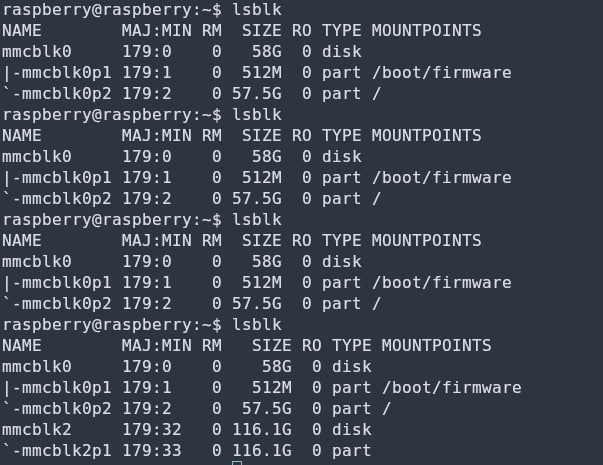
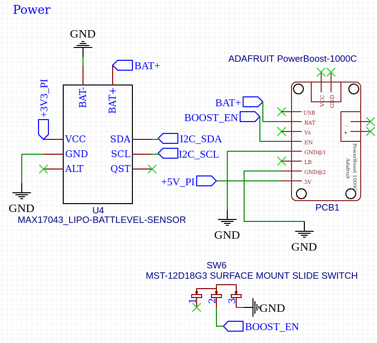
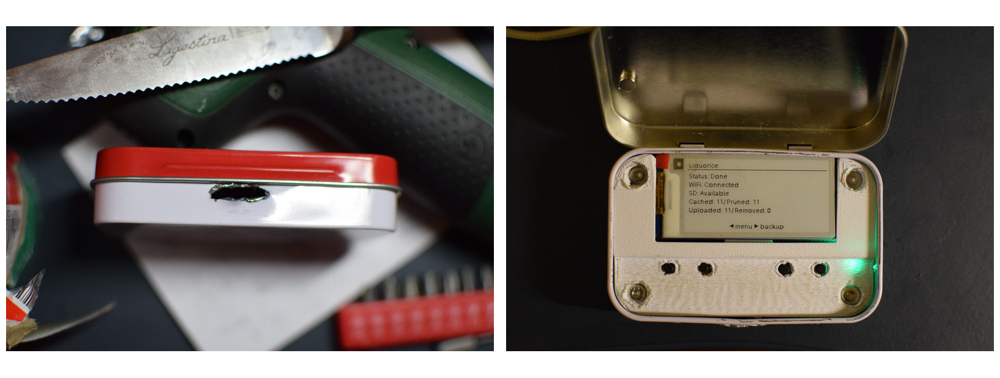

# Indice

- Introduzione: demo, idea, funzionalità
- Hardware: part list, schema, saldature, stampa 3D, assemblaggio
- Software: configurazione, moduli, design pattern, caso d'uso
- Sviluppi futuri

# Demo

- Tre video nella home del progetto:
  [github.com/stbuccia/amarelli-backup](https://github.com/stbuccia/amarelli-backup/blob/main/wiki/Home.md)
- `demo.mp4`: caching, upload in background, pausa e ripresa
- `cover.mp4`: chiusura del coperchio, blocco dello schermo
- `wifi.mp4`: nuova rete Wi-Fi da access point e pagina web

# L'idea

- Esperienza personale in viaggio: no backup per la SD della fotocamera
- Nessun DIY open source che risolve il problema
- Collezionista involontario di scatolette Amarelli

# Funzionalità e impostazioni

- Destinazione: qualsiasi remoto `rclone` (Dropbox, Drive, S3, ...) o WebDAV nativo
- **Mirroring**: le cancellazioni sulla SD si propagano al remoto
- **Pruning** della cache: subito, dopo 7 giorni, dopo 30 giorni, conserva
- Filtro file: tutti, foto (JPG+RAW), solo JPG
- Modalità: manuale passo a passo o automatica a latta chiusa (LED)
- Ogni impostazione da menù o dalla pagina web, salvata su `config.json`

# 2. Hardware

# Part list

| Componente | Ruolo | Prezzo | In uso |
|---|---|---|---|
| Raspberry Pi Zero W | cervello, Wi-Fi integrato | 34,51 € | Sì |
| Waveshare 2.13" e-Paper | schermo, CE0 | 14,69 € | Sì |
| Lettore microSD SPI | scheda fotocamera, CE1 | 2,07 € | Sì |
| LED WS2812B | stato a latta chiusa | 2,09 € | Sì |
| 4 pulsanti 6 × 6 × 6 mm | interfaccia input utente | 1,29 € | Sì |
| Reed switch + magnete | coperchio | 8,69 € | Sì |
| PowerBoost 1000C | boost 5 V + power path | n.d. | No |
| MAX17043 | fuel gauge I²C | n.d. | No |
| LiPo 803450 | batteria 1500 mAh | n.d. | No |

# Part list: note

- Totale: **110,71 €** (con sd, latta, viti, fili e biadesivo) + spedizione
- Microcomputer per esclusione: Pi 3/4/5 grandi, Pico senza OS, CM senza header
- Lettore SD su SPI e non sulla porta USB
- E-paper e non LCD: bistabile, leggibile al sole, refresh lento accettabile
- Reed in plastica: quelli in ampolla di vetro si sono rotti
- Alimentazione finale: micro-USB, niente batteria

# Il lettore SD si è rotto

::: columns
:::: column

::::
:::: column
- Rotto progressivamente in pochi giorni
- Scheda rilevata a tratti, poi più nulla
- Pipeline ok con Fake SD e cache
- Ipotesi scartata: contatti del modulo SPI
- Modulo da sostituire
::::
:::

# Schema finale

# Schema finale

# Saldature e cablaggio

::: columns
:::: column

::::
:::: column
- Perma proto board delle dimensioni esatte
- Componenti tutti sul lato frontale
- Pi: facce opposte, 8 fili
- MOSI/CLK sulla colona del lettore SD
- Cablaggio tutto sul retro
::::
:::

# Stampa 3D

# Assemblaggio

# 3. Software

# Configurazione

- Raspberry Pi OS Lite 32 bit, tutto in `install.sh` (idempotente)
- Lettore SD: `dtparam=spi=on` + device tree overlay
- Display `spidev0.0`, lettore `spidev0.1`, scheda `/dev/mmcblk1`
- Driver Waveshare: patch `sed` del reset BCM 17 → 27
- systemd

# Moduli

- `main.py` orchestrazione, loop
- `backup.py` macchina a stati: `cache.py` copia e pruning, `uploader.py` webdav / rclone 
- `menu.py` gestione del menu
- `config.py` file di configurazione
- `database.py` SQLite
- `wifi.py` access point, `flask_app.py` web
- `keylistener.py`: interfaccia di input 
- `display.py` e `led_status.py` interfaccia di output

# Design pattern

- Event bus: `on()` / `emit()`
- Macchina a stati (`backup.py`): IDLE, CACHING, UPLOADING, PRUNING, REMOVING, PAUSED, RETRYING, ERROR, DONE
- Repository (`database.py`): SQL solo qui, `FileRecord`
- Template method + strategy (`uploader.py`)
    - sottoclassi: `ensure_remote_dir()`, `put()`, `delete()`
- Composite (menù): struttura ad albero

# Caso pratico: caching

- BCM 19 a massa → coda 
- Main: vista attiva + stato → stato e `IDLE` = avvia
- Mount ritentato; con soli pendenti si parte senza scheda
- `Backup.start()`: impostazioni congelate, thread avviato
- Filtro estensione, confronto dimensione/mtime con il DB
- `backup:state` a ogni transizione → fase sullo schermo, LED blu lampeggiante
- `cache:file` per ogni file scandito → avanza la barra e contatori display

# Caso pratico: upload

- Pendenti dal DB
- Stato dedotto dai timestamp (`cached_at`, `uploaded_at`)
- Idempotenza: interruzione a metà → riprende senza ripristino
- `file:uploaded` a conferma di un trasferimento
- Pruning locale (upload) o pulizia del remoto (mirror): `file:pruned`, `file:remote_deleted`
- `backup:state` con `COMPLETED`: statistiche, "Done", LED verde

# 4. Sviluppi futuri

- Lettore SD: Rimpiazzare con un nuovo modulo
- Batteria: Alternativa a PowerBoost 1000C (PowerBoost 1000 Basic)
- Pulsanti più alti: topper piano, stampabile senza supporti e migliore pressione 
- PCB: schema pronto, circuito già validato

# Grazie

- Repository: [github.com/stbuccia/amarelli-backup](https://github.com/stbuccia/amarelli-backup)
- Documentazione utente e demo: [wiki/Home.md](https://github.com/stbuccia/amarelli-backup/blob/main/wiki/Home.md)
