# 1. What you need

Buy or find these parts before you start. I have ordered this from Italy, some links could not works in other states, but surely you could find with normal text research.

## Main parts

| Photo | Part | Notes | Link | Price |
|---|---|---|---|---|
|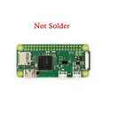| Raspberry Pi Zero W / 2W | The brain of the box. I have used the Zero W, but the Zero 2 W is also better | [Aliexpress](https://it.aliexpress.com/item/1005005171008740.html) | 34.51€ |
|| An Amarelli liquorice tin | You could use also other thin that has the standard 94 x 60 x 22  mm. You buy the case, but also you have the liquorices| Local market, but you can order it on [Amarelli website](https://www.amarelli.it/categoria-prodotto/lattine-amarelli/) | 4.50€ |
|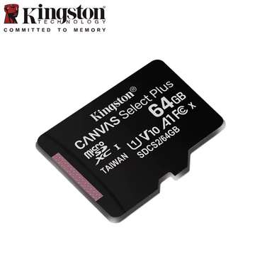| microSD card for the Pi | As you want from 16 GB, but not much lower to camera SD card, I use a 64 GB. This holds the system, it is not for the camera, but space is also used for local copy (caching) | [Aliexpress](https://it.aliexpress.com/item/1005009911349196.html) | 22.99€ |
|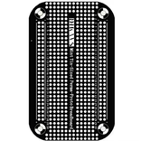| Mint Tin-Sized Perma-Proto Breadboard | Luckly someone produces this board that fits perfectly | [Aliexpress](https://it.aliexpress.com/item/1005002684081953.html)| 2.72€ |
|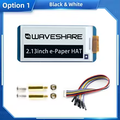| Waveshare 2.13" e-Paper HAT (V4) | The screen. It must be the V4 version. Other versions use a different driver. | [Washare website](https://www.waveshare.com/product/displays/e-paper/2.13inch-e-paper-hat-plus.htm) | 14.69€ |
|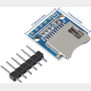| External microSD reader (SPI) | Reads the camera card. It must be an SPI reader, not a USB one. You push the camera card in here. | [Aliexpress](https://www.aliexpress.com/item/1005009513901655.html) | 2.07€ |
|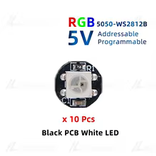| WS2812B LED | Need one, but also more is a good idea | [Aliexpress](https://it.aliexpress.com/item/1005009513901655.html) | 2.09€ |
|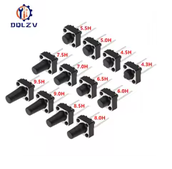| 4 push buttons  6 x 6 x 6 | For the menu on the box, you could also take taller ones. At least four | [Aliexpress](https://it.aliexpress.com/item/1005006046180384.html) | 1.29€ |
|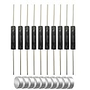| Reed switch + small magnet | A magnet switch, you must prefer the plastic ones beacause are less fragile. | [Amazon](https://www.amazon.it/dp/B07Z4RR4QV) | 8.69€ |
|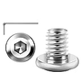| M3 x 6mm Flat Head Screws | For assembly 3d printed models | [Amazon](https://www.amazon.it/dp/B0FZBX7NF3) | 7.48€ |
|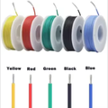| 16-30AWG 5 Colors DIY Wire Silicone | For wiring components | [Aliexpress](https://it.aliexpress.com/item/1005007671008743.html) | 5.99€ |
|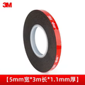| 3M 5952 Strong Double Sided Adhesive Tape VHB | For fixing parts | [Aliexpress](https://www.aliexpress.com/item/1005007671008743.html) | 2.69€ | 

Total price: **110.71€** + shipping. This price is what I actually paid, could change depending location and when parts are ordered

## Needed but not included in price

All these object I had already, so the are not buyed

- Power supply micro-USB, 5V 2 A or more
- Electric soldering iron
- Multimeter
- Caliber
- Glue
- 3d printed models

When you have the parts, go to [Wiring and assembly](02-wiring-and-assembly.md).
