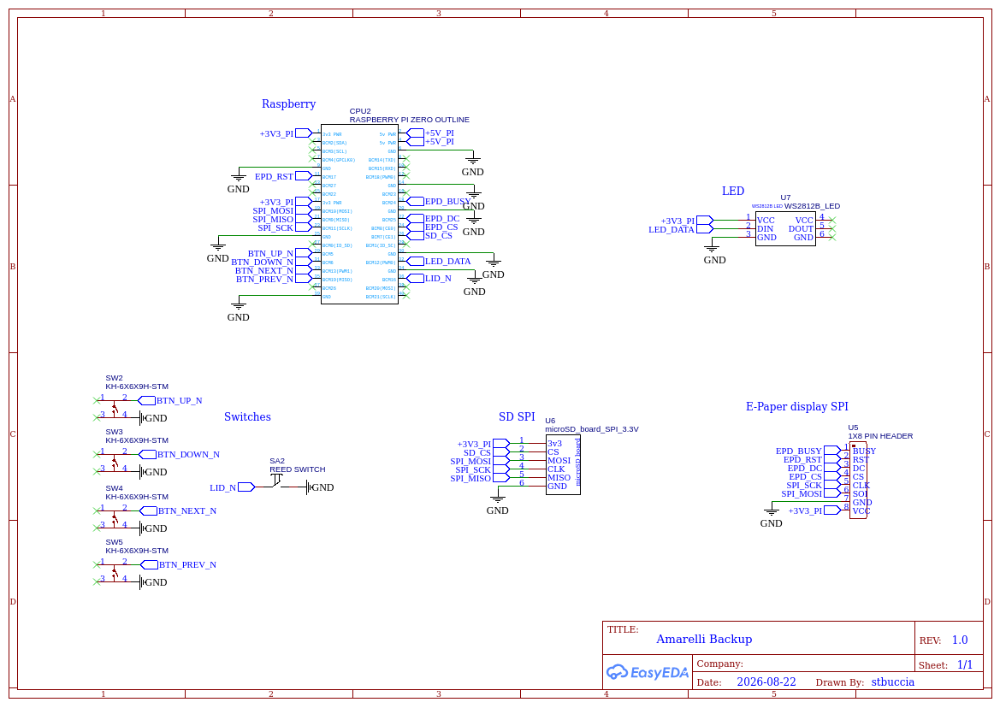
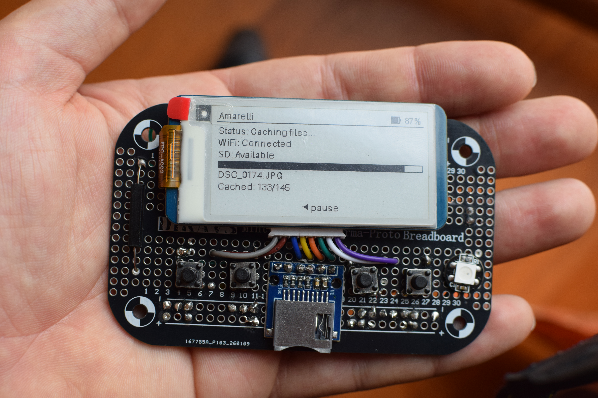
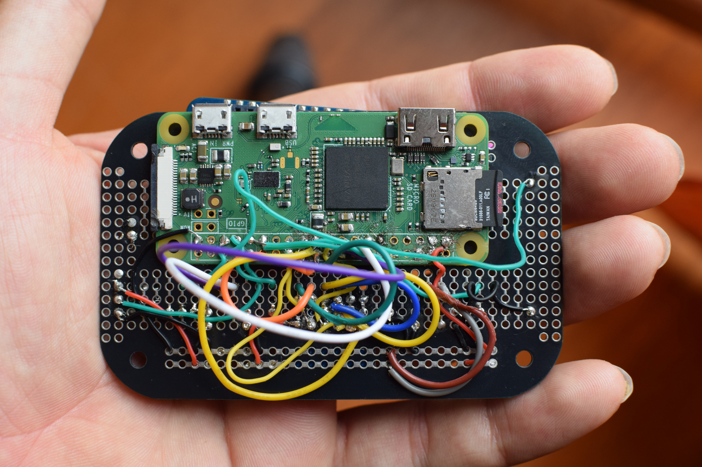
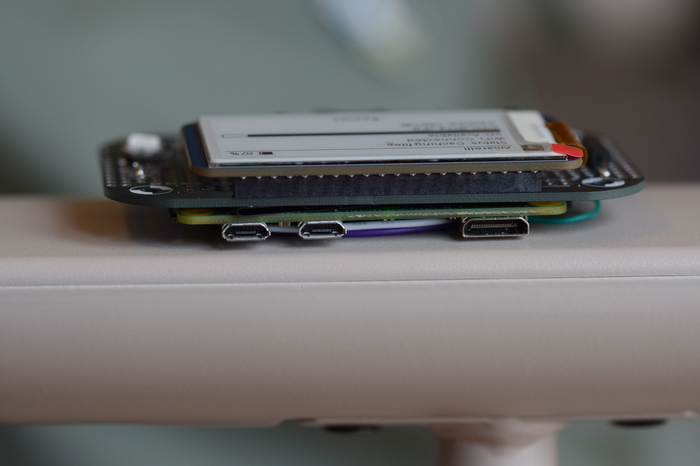
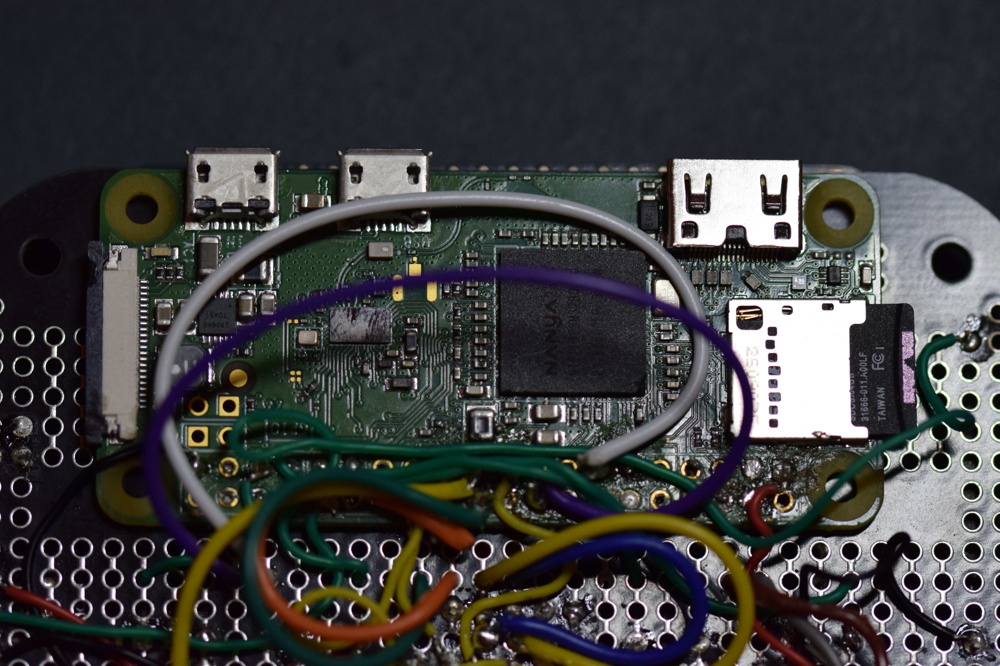
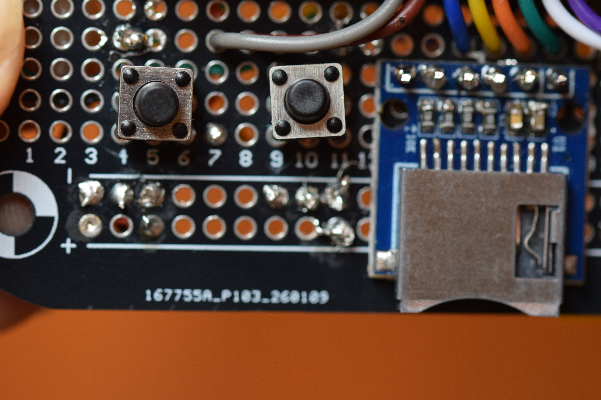
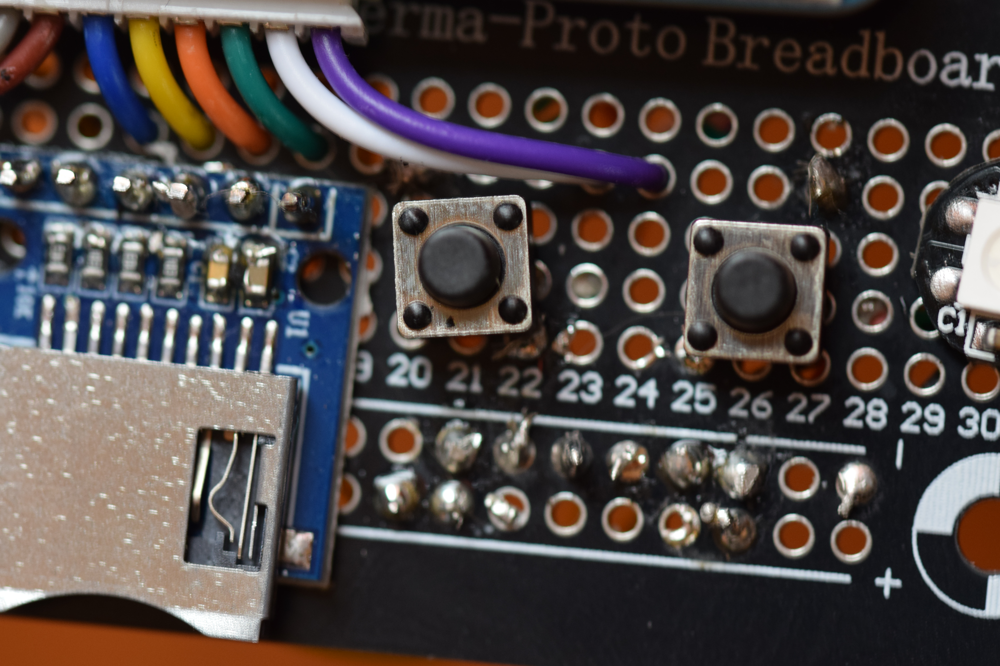
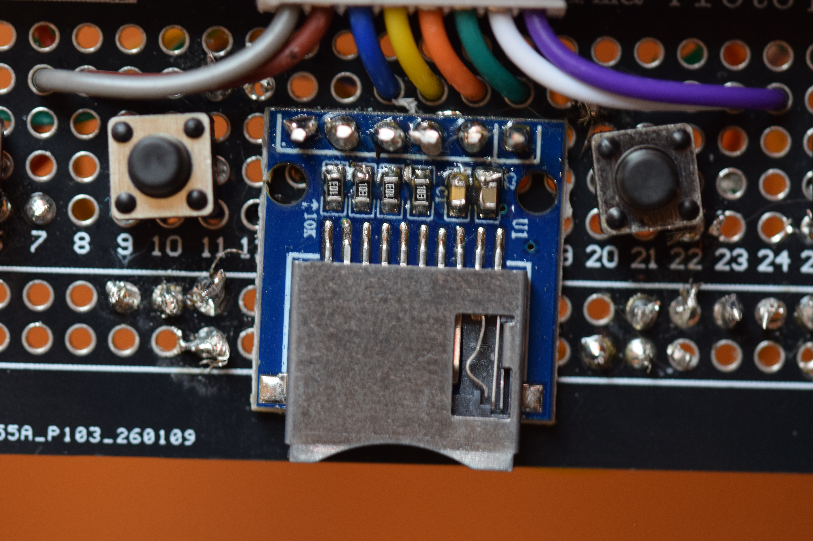
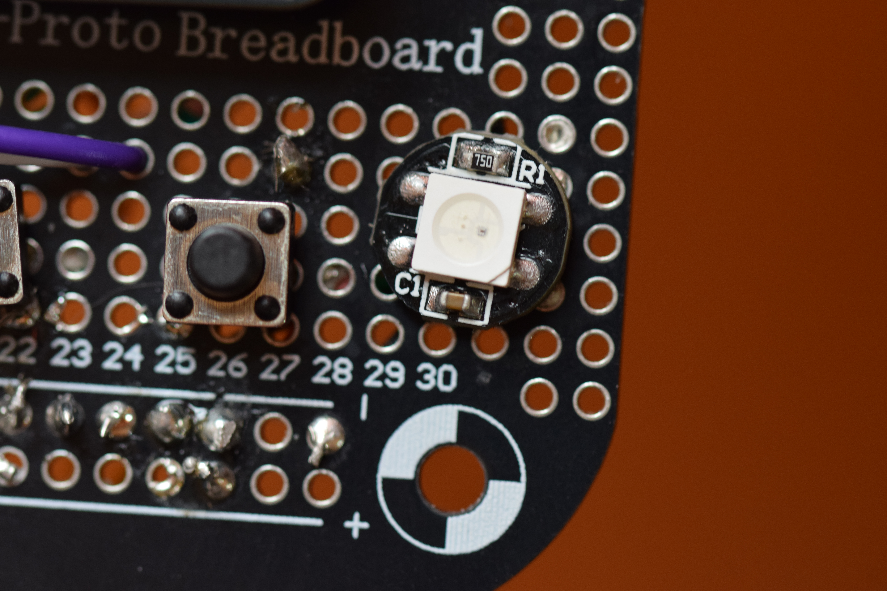
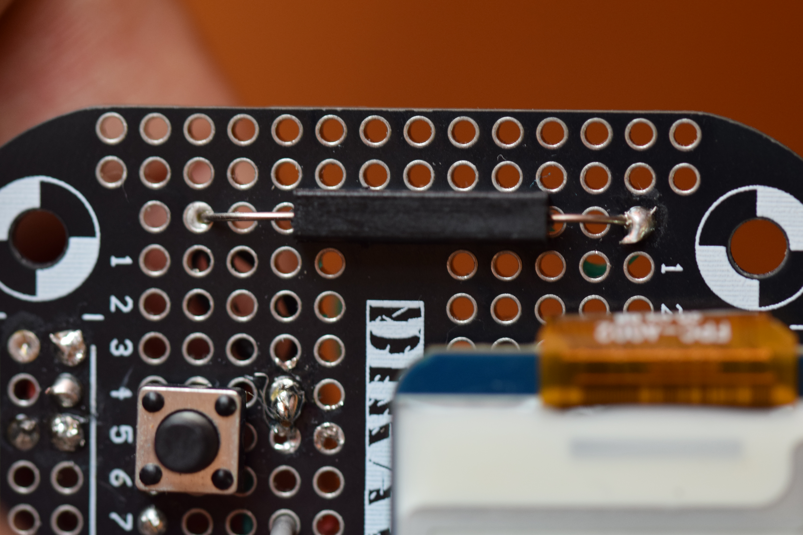

# 2. Wiring and assembly

This chapter shows where to solder component on the board and how to connect each part to the Raspberry Pi. You can follow the [electrical schematic](../hardware/schematic.png) if you want a picture to follow.

*Electrical schematic: overview of all connections to the Raspberry Pi (see `hardware/schematic.png`).*

Remember that the perma-proto breadboard there is row-column connection logic.

In this guide I use board row and column coordinates in order to give you precise assembly. The column is already numered on the board, the row numeber instead needs to be counted, I refer them counting above the bottom `+/-` row

## Order of assembly

1. The Raspberry Pi, fixed in bottom face of the perma-proto breadboard
2. Buttons, card reader, LED strip and reed switch
3. The screen last, since it covers most of the header.

After wiring you should look something like:

*Front view: the top part of the Raspberry and the Screen, must coincide with the top border of the board*

*Back view: the Pi fixed on the back face of the board.*

*Top view: with all parts soldered*

## Raspberry Pi

The Pi Zero is mounted upside-down on the back face of the perma-proto board, like in the following picture, checking that the upper side of the raspberry coincide with the upper board of the board, and that Raspberry is centered (you can check it if it cover all the pin of `+/-` rows). For the moment use not the strongest tape, in order to move a bit during the 3d printing assembly.

*Raspberry Pi Zero mounted on the back face of the perma-proto board: header centered and soldered on the lower side.*

## 3v3 and GND

Wire and solder  3.3 V pin (like 1) and GND like (39) along the `+`/`-` rails so every module can pick them up nearby. Keep the rails continuous and check with a multimeter before powering on.

## Buttons

There are four buttons: **Up**, **Down**, **Confirm (Right)**, and **Back (Left)**. Wire one side of each button to its BCM pin following the table, and the other side to the `-` column of the board. Place them in the **row 2**, as shown in the pictures below

| Button | BCM | Physical pin | Column  of the board |
|---|---|---|---|
| Up | 5 | 29 | 4 and 6|
| Down | 6 | 31 | 9 and 11|
| Confirm (Right) | 13 | 33 | 20 and 22 |
| Back (Left) | 19 | 35 | 25 and 27|

These are the pins the software reads.

*The up and down buttons.*

*The confirm and back buttons*

## Card reader (external, SPI)

The camera card reader shares the same SPI0 bus as the display, but uses the second chip-select (CE1). The installer turns it on with a small system setting and runs the bus at 10 MHz.
Place also the card SPI pinout in the **row 3**.

| SD signal | BCM | Physical pin | Column |
|---|---|---|---|
| GND | GND |  `-`  | 13 |
| MISO | 9 | 21 | 14 |
| CLK  | 11 | 23 |15 |
| MOSI | 10 | 19 |16 |
| CS | 7 | 26 |17 |
| 3v3 | 3.3 V | `+` | 18 |

*External microSD reader placement in the board*

After the software is installed and the Pi reboots, the card is mounted for you at `/mnt/liquorice-sd`.

## LED strip (WS2812B, 10 LEDs)

Place the led vertically in the right part of the board,  where the holes are not connected with other rows and columns, in the column *32* 

| LED wire | BCM | Physical Pin | Row | 
|---| --- | --- | --- |
| GND |  GND | `-` | 2 |
| DIN | BCM 12 | 32 | 3 |
| 5 V | 5V | 2 (or 4) | 4 |

*Led placement in the board *

## Reed switch (lid sensor)

Place the led vertically in the left part of the board, where the holes are not connected with other rows and columns, in the column *0* 

| Reed wire | BCM | Physical Pin | Row
|---|---|---|---|
| Upper part | 16 | 36 | 12 | 
| Lower part | GND | `-` | 2 | 

*Reed switch on the edge of the board: one wire to BCM 16 (pin 36), the other to GND.*

Keep attention reed switch is very fragile!
Glue the magnet to the lid, so shutting the lid closes the switch. When the switch is closed, the box treats the lid as shut and sleeps the screen.

## Display (Waveshare 2.13" e-Paper, V4)

The display uses the SPI0 bus. Before wiring you to insert the wire connector in the screen hat, then you should cut the final part of the wire in order to have a male wire in one side (instead female). Then solder the wire following the table below, consider that some pin are shared with the Card Reader (MOSI, CLK) you have to solder the wire in the same column. Consider that the top side of the display must coincide with the top side of the board, otherwise it does not fit in the box.

| Display signal | BCM | Physical pin | 
|---|---|---|
| VCC | 3.3 V | + |
| GND | GND | - |
| DIN | 10 | 19 |
| CLK | 11 | 23 |
| CS / CE0 | 8 | 24 |
| DC | 25 | 22 |
| RST | 27 | 13 |
| BUSY | 24 | 18 |

In this project the reset wire (RST) goes to **BCM 27**, not the BCM 17 that Waveshare uses by default because in my RPi that pin is broken. The installer fixes the driver for you (see chapter 4), so keep RST on BCM 27.

## Check before you power on

- No wire touches both 5 V and 3.3 V.
- The display RST goes to BCM 27 (pin 13).
- The LED data wire is on BCM 12 (pin 32).
- No pin is shorted to the pin next to it.

## Test the hardware

Before assembly with the 3d printed part and placing it in the Amarelli box it's better proceeding with software installation and configuration, in order to run test for verifying that everything is working. 

Once everything is wired, you should test each part before you trust the box. The test scripts need the software, so you run them after you install it. There is a small script for the screen, the buttons, the reed switch, the LED strip, and the card reader

When everything is wired, go to [Prepare the SD card and OS](03-prepare-os.md).
