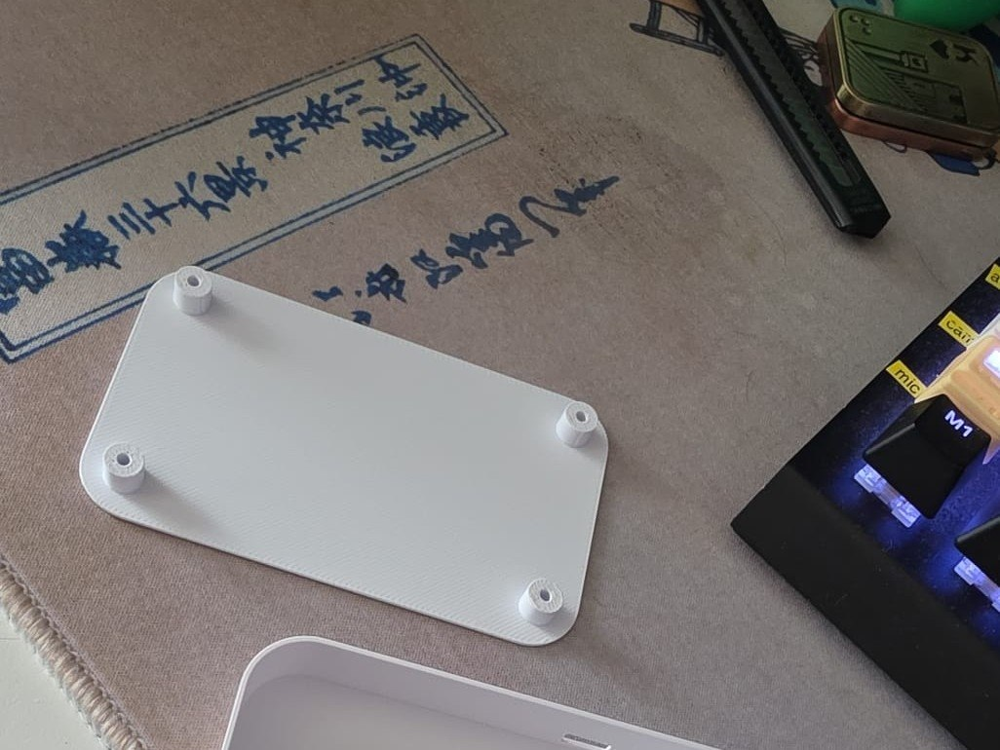
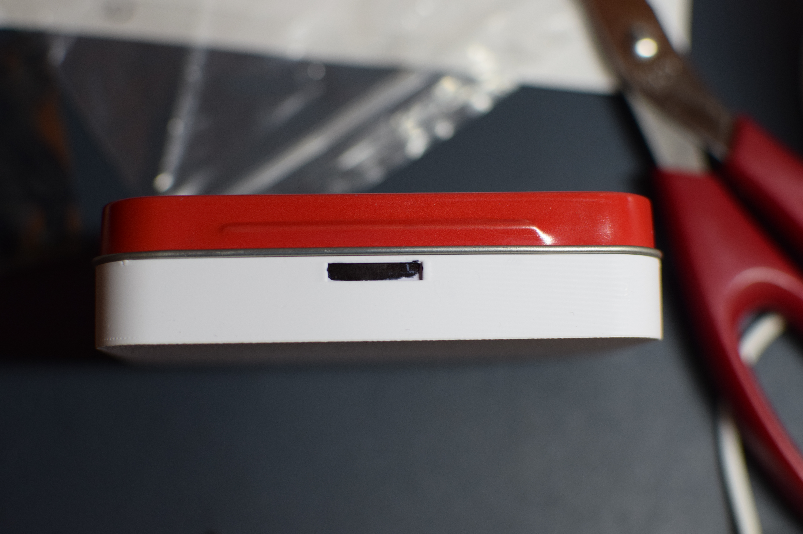
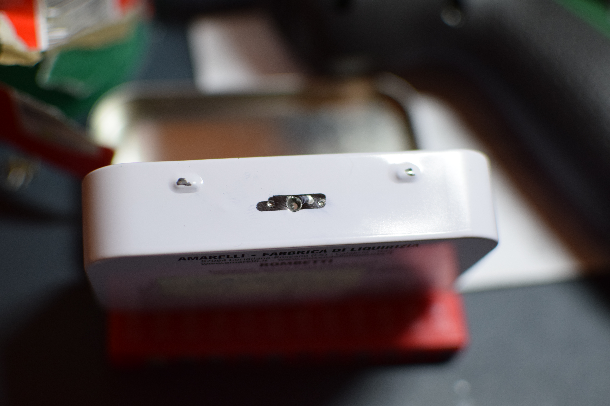
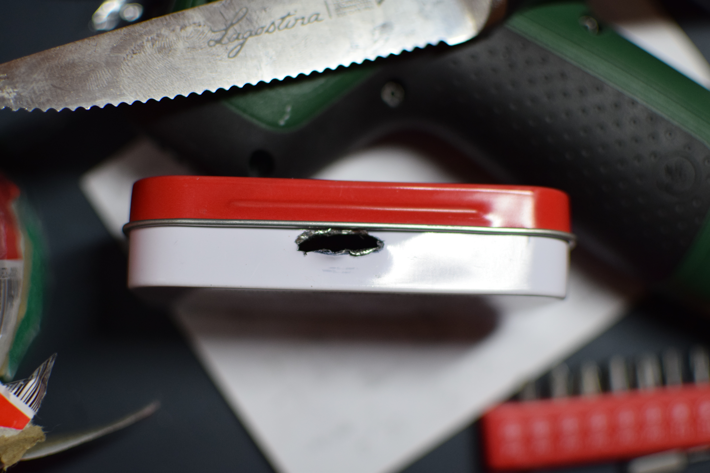

# 6. Assembly

Now that the board is wired and the software is installed and tested, it's time to put everything inside the Amarelli tin. This chapter covers the 3D printed parts and how to fit them in the box.

Do not rush this part. The tin is thin and the holes need to be made by hand, so check the fit at every step before you fix anything permanently.

## 3D printed parts

You need three printed parts: the base, the cover and the topper. The files are in the repository under `hardware/3d models/`.

| Part | What it is | Download | Photo |
|---|---|---|---|
| **Base** | The bottom frame that sits inside the tin and holds the board. | [base.3mf](../hardware/3d%20models/base.3mf) |  |
| **Cover** | The outer shell that wraps the tin. You use it as a template for the holes. | [cover.3mf](../hardware/3d%20models/cover.3mf) |  |
| **Topper** | The top frame with cutouts for the screen and the four buttons. | [topper.3mf](../hardware/3d%20models/topper.3mf) |  |

#### Printing settings

Tested on a **Bambu Lab H2D** with **eSUN PLA Basic white** in AMS. Standard **0.4 mm nozzle**.

| Part | Filament | Supports |
|---|---|---|
| **Base** | ~8 g | No |
| **Cover** | ~8 g | No |
| **Topper** | ~19 g | Yes — auto placement, **Tree** supports |

> **Supports:** you only need supports for the **topper**. The base and the cover print fine without them. For the topper use Tree supports with auto placement (overhangs for the screen and button openings), otherwise the bridges will sag and the screen won't sit flat. After printing remove the supports carefully with a cutter and clean the edges with sandpaper.

## What you need for this step

At this point you should have: 

- The three printed parts above
- The Amarelli tin (empty)
- The wired perma-proto board with Pi, screen, buttons, LED and reed switch already soldered

For the assembly you have also to use :

- Fine tip permanent marker
- Small drill / electric screwdriver with a fine tip
- Cutter and fine sandpaper 
- Strong double-sided tape: I used the [3M 5952 VHB](../01-what-you-need.md) from the part list
- 4x M3 x 6 mm flat head screws: also in the [part list](../01-what-you-need.md)

Test the hardware once more before you close everything (see [Install the software](04-install-software.md): the `test_display.py`, `test_buttons.py` etc.). If there is a need to fix a wire it's easier to do it now.

## Assembly steps

### 1. Mark the holes on the tin

1. Take the empty tin and put it inside the printed cover
2. With the **fine tip permanent marker**, mark all the holes (sd, micro-usb and led) through the printed parts onto the tin. Do it from inside and outside so the marks are visible.

*Marking the SD opening through the cover: the black marker line shows where to cut.*

### 2. Drill and finish the holes

1. Start each mark with the **electric screwdriver with a fine tip**. Don't push hard, just make a small pilot hole. The tin is thin and bends easily.
2. Enlarge and square the holes with pincers like **pliers**. Cut a little at a time.
3. Clean every edge with **cutter** and **sandpaper** so there are no burrs. The SD card should slide without catching and the USB plugs should go in without forcing.

*First pilot hole made with the fine tip: start small, don't push hard.*

*SD slot after enlarging: the card should slide.* 

### 3. Fix the base

1. Remove the cover from the tin.
2. Insert the **base** inside the tin, on the bottom.
3. Fix it with a couple of strips of **strong double-sided tape (3M 5952 VHB)**. Press firmly for some seconds, it should not move when you shake the tin.

### 4. Place the board and align the Pi

1. Put the wired board inside, on top of the base.
2. **Align the SD slot of the external reader and the micro-USB sockets of the Raspberry Pi** with the holes you just made on the side of the tin. Look from the outside and from the inside.
3. When the alignment is right: both USB ports are centered and the SD clicks in and out cleanly: fix the **Raspberry Pi to the base with strong tape**. For the moment don't press too hard, just enough to keep it from shifting. You still need a little play for the topper.
4. If a hole is off by a millimetre, take the board out and widen it with cutter and sandpaper.

### 5. Fit the topper and the screen

1. Place the **topper** on top of the board.
2. The **screen and the four buttons must come out** through the topper openings, flat and centered. If they rub or don't pass, enlarge the cutouts with cutter and sandpaper. Remove only a little at a time and test again.
3. When the screen sits flush and the buttons all click freely, fix the **screen to the board with a small piece of strong tape**, you can just place it below the pins hat

### 6. Close everything with screws

1. Check that **the holes of the base, the perma-proto board and the topper are all aligned**. You should see through them in one straight line at each corner.
2. Put the **M3 x 6 mm screws** in. Start them by hand so you don't cross-thread.
3. Tighten with the **electric screwdriver**: easier and more even than by hand. Don't over-tighten, the printed plastic will crack if you force it.

That's it. Give it a shake: nothing should rattle inside. Power it on placing the micro-usb, close the lid and check that the reed switch sleeps the screen, then open it and check that `Ready` shows up.

<!-- Final Foto --> 

Next: [Daily use](07-daily-use.md): how to use the box day to day.
